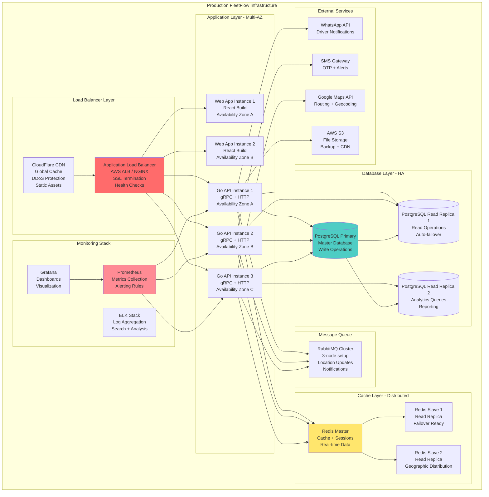

# 🚀 **Phase 2: Production Infrastructure Deployment Guide - India Focus**

## 📊 **PHASE OVERVIEW**
**Timeline:** Weeks 4-6 (3 weeks)  
**Investment:** ₹40 lakhs  
**Priority:** 🔴 CRITICAL for production launch in Indian market  
**Goal:** Deploy enterprise-grade production infrastructure with 99.9% uptime in Indian data centers  
**Prerequisites:** Phase 1 software completion with Indian compliance  
**Indian Requirements:** Data localization (DPDP Act), AWS Mumbai/Chennai regions, Indian timezone optimization

---

## 🎯 **PRODUCTION INFRASTRUCTURE ARCHITECTURE**



---

## 🔧 **WEEK 1: CORE INFRASTRUCTURE SETUP**

### **Day 1-2: Cloud Infrastructure & Networking**

#### **AWS Infrastructure Setup - India Regions**
```bash
# Infrastructure as Code - Terraform
# File: infrastructure/terraform/indian_infrastructure.tf

provider "aws" {
  region = "ap-south-1"  # Mumbai region for primary operations
}

provider "aws" {
  alias  = "backup"
  region = "ap-south-2"  # Hyderabad region for disaster recovery
}

# Multi-region setup for Indian compliance
locals {
  indian_regions = ["ap-south-1", "ap-south-2"]  # Mumbai and Hyderabad
  indian_compliance = {
    data_residency = true
    dpdp_compliance = true
    indian_timezone = "Asia/Kolkata"
  }
}

# VPC and Networking
resource "aws_vpc" "fleetflow_vpc" {
  cidr_block           = "10.0.0.0/16"
  enable_dns_hostnames = true
  enable_dns_support   = true
  
  tags = {
    Name = "fleetflow-production-vpc"
    Environment = "production"
  }
}

# Public Subnets for Load Balancer
resource "aws_subnet" "public_subnets" {
  count                   = 3
  vpc_id                  = aws_vpc.fleetflow_vpc.id
  cidr_block              = "10.0.${count.index + 1}.0/24"
  availability_zone       = data.aws_availability_zones.available.names[count.index]
  map_public_ip_on_launch = true
  
  tags = {
    Name = "fleetflow-public-subnet-${count.index + 1}"
    Type = "public"
  }
}

# Private Subnets for Applications
resource "aws_subnet" "private_subnets" {
  count             = 3
  vpc_id            = aws_vpc.fleetflow_vpc.id
  cidr_block        = "10.0.${count.index + 10}.0/24"
  availability_zone = data.aws_availability_zones.available.names[count.index]
  
  tags = {
    Name = "fleetflow-private-subnet-${count.index + 1}"
    Type = "private"
  }
}

# Database Subnets
resource "aws_subnet" "database_subnets" {
  count             = 3
  vpc_id            = aws_vpc.fleetflow_vpc.id
  cidr_block        = "10.0.${count.index + 20}.0/24"
  availability_zone = data.aws_availability_zones.available.names[count.index]
  
  tags = {
    Name = "fleetflow-database-subnet-${count.index + 1}"
    Type = "database"
  }
}

# Internet Gateway
resource "aws_internet_gateway" "fleetflow_igw" {
  vpc_id = aws_vpc.fleetflow_vpc.id
  
  tags = {
    Name = "fleetflow-production-igw"
  }
}

# NAT Gateways for private subnets
resource "aws_nat_gateway" "nat_gateways" {
  count         = 3
  allocation_id = aws_eip.nat_eips[count.index].id
  subnet_id     = aws_subnet.public_subnets[count.index].id
  
  tags = {
    Name = "fleetflow-nat-gateway-${count.index + 1}"
  }
}

resource "aws_eip" "nat_eips" {
  count  = 3
  domain = "vpc"
  
  tags = {
    Name = "fleetflow-nat-eip-${count.index + 1}"
  }
}
```

#### **Security Groups Configuration**
```terraform
# Load Balancer Security Group
resource "aws_security_group" "alb_sg" {
  name_prefix = "fleetflow-alb-"
  vpc_id      = aws_vpc.fleetflow_vpc.id
  
  ingress {
    from_port   = 80
    to_port     = 80
    protocol    = "tcp"
    cidr_blocks = ["0.0.0.0/0"]
  }
  
  ingress {
    from_port   = 443
    to_port     = 443
    protocol    = "tcp"
    cidr_blocks = ["0.0.0.0/0"]
  }
  
  egress {
    from_port   = 0
    to_port     = 0
    protocol    = "-1"
    cidr_blocks = ["0.0.0.0/0"]
  }
  
  tags = {
    Name = "fleetflow-alb-security-group"
  }
}

# Application Security Group
resource "aws_security_group" "app_sg" {
  name_prefix = "fleetflow-app-"
  vpc_id      = aws_vpc.fleetflow_vpc.id
  
  ingress {
    from_port       = 8080
    to_port         = 8080
    protocol        = "tcp"
    security_groups = [aws_security_group.alb_sg.id]
  }
  
  ingress {
    from_port       = 9090  # gRPC port
    to_port         = 9090
    protocol        = "tcp"
    security_groups = [aws_security_group.alb_sg.id]
  }
  
  ingress {
    from_port   = 22
    to_port     = 22
    protocol    = "tcp"
    cidr_blocks = ["10.0.0.0/16"]  # VPC only
  }
  
  egress {
    from_port   = 0
    to_port     = 0
    protocol    = "-1"
    cidr_blocks = ["0.0.0.0/0"]
  }
  
  tags = {
    Name = "fleetflow-application-security-group"
  }
}

# Database Security Group
resource "aws_security_group" "db_sg" {
  name_prefix = "fleetflow-db-"
  vpc_id      = aws_vpc.fleetflow_vpc.id
  
  ingress {
    from_port       = 5432
    to_port         = 5432
    protocol        = "tcp"
    security_groups = [aws_security_group.app_sg.id]
  }
  
  tags = {
    Name = "fleetflow-database-security-group"
  }
}
```

### **Day 3-4: Database High Availability Setup**

#### **PostgreSQL RDS Configuration**
```terraform
# Database Subnet Group
resource "aws_db_subnet_group" "fleetflow_db_subnet_group" {
  name       = "fleetflow-production"
  subnet_ids = aws_subnet.database_subnets[*].id
  
  tags = {
    Name = "fleetflow-db-subnet-group"
  }
}

# Primary Database
resource "aws_db_instance" "fleetflow_primary" {
  identifier = "fleetflow-primary"
  
  # Engine Configuration
  engine         = "postgres"
  engine_version = "14.9"
  instance_class = "db.r5.xlarge"  # 4 vCPU, 32GB RAM
  
  # Storage Configuration
  allocated_storage     = 1000  # 1TB SSD
  max_allocated_storage = 5000  # Auto-scaling up to 5TB
  storage_type          = "gp2"
  storage_encrypted     = true
  
  # Database Configuration
  db_name  = "fleetflow"
  username = "fleetflow_admin"
  password = var.db_password  # Stored in Terraform variables
  port     = 5432
  
  # Networking
  vpc_security_group_ids = [aws_security_group.db_sg.id]
  db_subnet_group_name   = aws_db_subnet_group.fleetflow_db_subnet_group.name
  publicly_accessible    = false
  
  # Backup & Maintenance
  backup_retention_period = 30  # 30 days
  backup_window          = "03:00-04:00"  # IST 8:30-9:30 AM
  maintenance_window     = "sun:04:00-sun:05:00"
  
  # Performance & Monitoring
  performance_insights_enabled = true
  monitoring_interval         = 60
  monitoring_role_arn         = aws_iam_role.rds_monitoring_role.arn
  
  # High Availability
  multi_az               = true
  deletion_protection    = true
  skip_final_snapshot   = false
  final_snapshot_identifier = "fleetflow-final-snapshot"
  
  tags = {
    Name = "fleetflow-primary-database"
    Environment = "production"
  }
}

# Read Replica 1 (Same Region)
resource "aws_db_instance" "fleetflow_read_replica_1" {
  identifier = "fleetflow-read-replica-1"
  
  replicate_source_db = aws_db_instance.fleetflow_primary.id
  instance_class      = "db.r5.large"  # Smaller for read workloads
  
  publicly_accessible = false
  
  tags = {
    Name = "fleetflow-read-replica-1"
    Environment = "production"
  }
}

# Read Replica 2 (Analytics)
resource "aws_db_instance" "fleetflow_read_replica_2" {
  identifier = "fleetflow-read-replica-analytics"
  
  replicate_source_db = aws_db_instance.fleetflow_primary.id
  instance_class      = "db.r5.large"
  
  publicly_accessible = false
  
  tags = {
    Name = "fleetflow-analytics-replica"
    Environment = "production"
  }
}
```

#### **Redis Cluster Setup**
```terraform
# Redis Subnet Group
resource "aws_elasticache_subnet_group" "fleetflow_redis_subnet_group" {
  name       = "fleetflow-redis-subnet-group"
  subnet_ids = aws_subnet.private_subnets[*].id
}

# Redis Security Group
resource "aws_security_group" "redis_sg" {
  name_prefix = "fleetflow-redis-"
  vpc_id      = aws_vpc.fleetflow_vpc.id
  
  ingress {
    from_port       = 6379
    to_port         = 6379
    protocol        = "tcp"
    security_groups = [aws_security_group.app_sg.id]
  }
  
  tags = {
    Name = "fleetflow-redis-security-group"
  }
}

# Redis Replication Group
resource "aws_elasticache_replication_group" "fleetflow_redis" {
  replication_group_id         = "fleetflow-redis-cluster"
  description                  = "FleetFlow Redis Cluster"
  
  # Node Configuration
  node_type                    = "cache.r5.large"  # 2 vCPU, 13GB RAM
  parameter_group_name         = "default.redis7"
  port                         = 6379
  
  # Cluster Configuration
  num_cache_clusters           = 3
  automatic_failover_enabled   = true
  multi_az_enabled            = true
  
  # Networking
  subnet_group_name           = aws_elasticache_subnet_group.fleetflow_redis_subnet_group.name
  security_group_ids          = [aws_security_group.redis_sg.id]
  
  # Backup & Maintenance
  snapshot_retention_limit    = 7
  snapshot_window            = "03:30-05:30"  # IST 9:00-11:00 AM
  maintenance_window         = "sun:05:30-sun:06:30"
  
  # Security
  at_rest_encryption_enabled = true
  transit_encryption_enabled = true
  auth_token                 = var.redis_auth_token
  
  tags = {
    Name = "fleetflow-redis-cluster"
    Environment = "production"
  }
}
```

### **Day 5-7: Application Deployment & Load Balancer**

#### **ECS Fargate Configuration**
```terraform
# ECS Cluster
resource "aws_ecs_cluster" "fleetflow_cluster" {
  name = "fleetflow-production"
  
  setting {
    name  = "containerInsights"
    value = "enabled"
  }
  
  tags = {
    Name = "fleetflow-production-cluster"
  }
}

# Application Load Balancer
resource "aws_lb" "fleetflow_alb" {
  name               = "fleetflow-production-alb"
  internal           = false
  load_balancer_type = "application"
  security_groups    = [aws_security_group.alb_sg.id]
  subnets           = aws_subnet.public_subnets[*].id
  
  enable_deletion_protection = true
  
  access_logs {
    bucket  = aws_s3_bucket.alb_logs.bucket
    prefix  = "alb"
    enabled = true
  }
  
  tags = {
    Name = "fleetflow-production-alb"
  }
}

# Target Group for Go API
resource "aws_lb_target_group" "api_target_group" {
  name     = "fleetflow-api-tg"
  port     = 8080
  protocol = "HTTP"
  vpc_id   = aws_vpc.fleetflow_vpc.id
  
  health_check {
    enabled             = true
    healthy_threshold   = 2
    unhealthy_threshold = 3
    timeout             = 5
    interval            = 30
    path                = "/health"
    matcher             = "200"
    port                = "traffic-port"
    protocol            = "HTTP"
  }
  
  tags = {
    Name = "fleetflow-api-target-group"
  }
}

# ALB Listener
resource "aws_lb_listener" "https_listener" {
  load_balancer_arn = aws_lb.fleetflow_alb.arn
  port              = "443"
  protocol          = "HTTPS"
  ssl_policy        = "ELBSecurityPolicy-TLS-1-2-2017-01"
  certificate_arn   = aws_acm_certificate_validation.cert_validation.certificate_arn
  
  default_action {
    type             = "forward"
    target_group_arn = aws_lb_target_group.api_target_group.arn
  }
}

# HTTP to HTTPS Redirect
resource "aws_lb_listener" "http_listener" {
  load_balancer_arn = aws_lb.fleetflow_alb.arn
  port              = "80"
  protocol          = "HTTP"
  
  default_action {
    type = "redirect"
    
    redirect {
      port        = "443"
      protocol    = "HTTPS"
      status_code = "HTTP_301"
    }
  }
}
```

#### **ECS Task Definition**
```json
{
  "family": "fleetflow-api",
  "networkMode": "awsvpc",
  "requiresCompatibilities": ["FARGATE"],
  "cpu": "1024",
  "memory": "2048",
  "executionRoleArn": "arn:aws:iam::ACCOUNT:role/ecsTaskExecutionRole",
  "taskRoleArn": "arn:aws:iam::ACCOUNT:role/fleetflow-task-role",
  "containerDefinitions": [
    {
      "name": "fleetflow-api",
      "image": "fleetflow/api:latest",
      "cpu": 1024,
      "memory": 2048,
      "essential": true,
      "portMappings": [
        {
          "containerPort": 8080,
          "protocol": "tcp"
        },
        {
          "containerPort": 9090,
          "protocol": "tcp"
        }
      ],
      "environment": [
        {
          "name": "ENV",
          "value": "production"
        },
        {
          "name": "LOG_LEVEL",
          "value": "info"
        }
      ],
      "secrets": [
        {
          "name": "DB_PASSWORD",
          "valueFrom": "arn:aws:ssm:ap-south-1:ACCOUNT:parameter/fleetflow/db/password"
        },
        {
          "name": "REDIS_AUTH_TOKEN",
          "valueFrom": "arn:aws:ssm:ap-south-1:ACCOUNT:parameter/fleetflow/redis/auth-token"
        },
        {
          "name": "JWT_SECRET",
          "valueFrom": "arn:aws:ssm:ap-south-1:ACCOUNT:parameter/fleetflow/jwt/secret"
        }
      ],
      "logConfiguration": {
        "logDriver": "awslogs",
        "options": {
          "awslogs-group": "/ecs/fleetflow-api",
          "awslogs-region": "ap-south-1",
          "awslogs-stream-prefix": "ecs"
        }
      },
      "healthCheck": {
        "command": ["CMD-SHELL", "curl -f http://localhost:8080/health || exit 1"],
        "interval": 30,
        "timeout": 5,
        "retries": 3,
        "startPeriod": 60
      }
    }
  ]
}
```

---

## 🔧 **WEEK 2: MONITORING & OBSERVABILITY**

### **Day 8-10: Prometheus & Grafana Setup**

#### **Prometheus Configuration**
```yaml
# prometheus/prometheus.yml
global:
  scrape_interval: 15s
  evaluation_interval: 15s

rule_files:
  - "rules/*.yml"

alerting:
  alertmanagers:
    - static_configs:
        - targets:
          - alertmanager:9093

scrape_configs:
  - job_name: 'fleetflow-api'
    static_configs:
      - targets: ['api-1:8080', 'api-2:8080', 'api-3:8080']
    metrics_path: '/metrics'
    scrape_interval: 30s
    
  - job_name: 'fleetflow-database'
    static_configs:
      - targets: ['postgres-exporter:9187']
    scrape_interval: 60s
    
  - job_name: 'fleetflow-redis'
    static_configs:
      - targets: ['redis-exporter:9121']
    scrape_interval: 30s
    
  - job_name: 'node-exporter'
    static_configs:
      - targets: ['node-exporter:9100']
    scrape_interval: 30s
```

#### **Grafana Dashboards**
```json
// FleetFlow Main Dashboard
{
  "dashboard": {
    "title": "FleetFlow Production Monitoring",
    "panels": [
      {
        "title": "API Request Rate",
        "type": "graph",
        "targets": [
          {
            "expr": "rate(fleetflow_http_requests_total[5m])",
            "legendFormat": "{{method}} {{status}}"
          }
        ]
      },
      {
        "title": "Response Time (95th percentile)",
        "type": "graph", 
        "targets": [
          {
            "expr": "histogram_quantile(0.95, fleetflow_http_request_duration_seconds_bucket)",
            "legendFormat": "95th percentile"
          }
        ]
      },
      {
        "title": "Active Vehicles",
        "type": "stat",
        "targets": [
          {
            "expr": "fleetflow_active_vehicles_total",
            "legendFormat": "Active Vehicles"
          }
        ]
      },
      {
        "title": "Database Connection Pool",
        "type": "graph",
        "targets": [
          {
            "expr": "fleetflow_db_connections_active",
            "legendFormat": "Active Connections"
          }
        ]
      }
    ]
  }
}
```

#### **Alerting Rules**
```yaml
# prometheus/rules/fleetflow.yml
groups:
  - name: fleetflow.production
    rules:
      - alert: HighErrorRate
        expr: rate(fleetflow_http_requests_total{status=~"5.."}[5m]) > 0.1
        for: 5m
        labels:
          severity: critical
        annotations:
          summary: "High error rate detected"
          description: "Error rate is {{ $value }} errors per second"
          
      - alert: DatabaseConnectionsHigh
        expr: fleetflow_db_connections_active > 80
        for: 2m
        labels:
          severity: warning
        annotations:
          summary: "Database connections high"
          description: "Database has {{ $value }} active connections"
          
      - alert: APIResponseTimeSlow
        expr: histogram_quantile(0.95, fleetflow_http_request_duration_seconds_bucket) > 2
        for: 5m
        labels:
          severity: warning
        annotations:
          summary: "API response time slow"
          description: "95th percentile response time is {{ $value }}s"
          
      - alert: RedisMemoryUsageHigh
        expr: (redis_memory_used_bytes / redis_memory_max_bytes) * 100 > 80
        for: 5m
        labels:
          severity: warning
        annotations:
          summary: "Redis memory usage high"
          description: "Redis memory usage is {{ $value }}%"
          
      - alert: VehicleLocationUpdatesLow
        expr: rate(fleetflow_location_updates_total[10m]) < 100
        for: 10m
        labels:
          severity: critical
        annotations:
          summary: "Vehicle location updates low"
          description: "Only {{ $value }} location updates per second"
```

### **Day 11-12: ELK Stack for Centralized Logging**

#### **Elasticsearch Configuration**
```yaml
# elasticsearch/elasticsearch.yml
cluster.name: fleetflow-production
node.name: ${HOSTNAME}
node.data: true
node.master: true

network.host: 0.0.0.0
http.port: 9200

discovery.seed_hosts: ["es-node-1", "es-node-2", "es-node-3"]
cluster.initial_master_nodes: ["es-node-1", "es-node-2", "es-node-3"]

# Memory and performance
indices.memory.index_buffer_size: 30%
indices.fielddata.cache.size: 20%

# Security
xpack.security.enabled: true
xpack.security.transport.ssl.enabled: true
xpack.security.http.ssl.enabled: true

# Monitoring
xpack.monitoring.collection.enabled: true
```

#### **Logstash Configuration**
```ruby
# logstash/pipeline/fleetflow.conf
input {
  beats {
    port => 5044
  }
}

filter {
  if [fields][service] == "fleetflow-api" {
    grok {
      match => {
        "message" => "%{TIMESTAMP_ISO8601:timestamp} %{LOGLEVEL:level} %{DATA:logger} %{GREEDYDATA:message}"
      }
    }
    
    date {
      match => [ "timestamp", "ISO8601" ]
    }
    
    # Parse structured logs (JSON)
    if [message] =~ /^\{.*\}$/ {
      json {
        source => "message"
      }
    }
    
    # Extract important fields for fleet operations
    if [message] =~ /vehicle_id/ {
      grok {
        match => {
          "message" => "vehicle_id[=:]%{NUMBER:vehicle_id}"
        }
      }
    }
    
    if [message] =~ /user_id/ {
      grok {
        match => {
          "message" => "user_id[=:]%{NUMBER:user_id}"
        }
      }
    }
  }
}

output {
  elasticsearch {
    hosts => ["es-node-1:9200", "es-node-2:9200", "es-node-3:9200"]
    index => "fleetflow-logs-%{+YYYY.MM.dd}"
    template_name => "fleetflow-template"
    template_pattern => "fleetflow-logs-*"
    template => "/usr/share/logstash/templates/fleetflow-template.json"
  }
  
  # Send critical errors to Slack/PagerDuty
  if [level] == "ERROR" or [level] == "FATAL" {
    http {
      url => "${SLACK_WEBHOOK_URL}"
      http_method => "post"
      format => "json"
      content_type => "application/json"
      mapping => {
        "text" => "🚨 FleetFlow Production Error: %{message}"
        "channel" => "#alerts"
      }
    }
  }
}
```

#### **Filebeat Configuration**
```yaml
# filebeat/filebeat.yml
filebeat.inputs:
- type: container
  paths:
    - '/var/lib/docker/containers/*/*.log'
  fields:
    service: fleetflow-api
  fields_under_root: true
  
- type: log
  enabled: true
  paths:
    - /var/log/nginx/*.log
  fields:
    service: nginx
    
output.logstash:
  hosts: ["logstash-1:5044", "logstash-2:5044"]
  loadbalance: true
  
processors:
- add_docker_metadata:
    host: "unix:///var/run/docker.sock"
    
- drop_fields:
    fields: ["agent", "ecs", "host", "input"]
```

### **Day 13-14: Message Queue & Real-time Processing**

#### **RabbitMQ Cluster Setup**
```yaml
# rabbitmq/rabbitmq.conf
cluster_formation.peer_discovery_backend = rabbit_peer_discovery_k8s
cluster_formation.k8s.host = kubernetes.default.svc.cluster.local

# Memory and disk management
vm_memory_high_watermark.relative = 0.6
disk_free_limit.relative = 1.0

# Management interface
management.tcp.port = 15672
management.ssl.port = 15671

# Federation for geographic distribution
federation_upstream_set.all.policy = ".*"

# High availability
ha_promote_on_shutdown = when_synced
ha_promote_on_failure = when_synced
```

#### **Queue Definitions**
```go
// Go code for queue setup
func (mq *MessageQueue) DeclareFleetFlowQueues(ctx context.Context) error {
    queues := []QueueDeclaration{
        {
            Name:       "location_updates",
            Durable:    true,
            AutoDelete: false,
            Arguments: amqp.Table{
                "x-message-ttl":          300000,  // 5 minutes
                "x-max-length":          100000,  // Max 100k messages
                "x-dead-letter-exchange": "fleetflow.dlx",
            },
        },
        {
            Name:       "driver_notifications",
            Durable:    true,
            AutoDelete: false,
            Arguments: amqp.Table{
                "x-message-ttl":          3600000, // 1 hour
                "x-max-priority":         10,       // Priority queue
                "x-dead-letter-exchange": "fleetflow.dlx",
            },
        },
        {
            Name:       "fuel_alerts",
            Durable:    true,
            AutoDelete: false,
            Arguments: amqp.Table{
                "x-message-ttl":          1800000, // 30 minutes
                "x-dead-letter-exchange": "fleetflow.dlx",
            },
        },
        {
            Name:       "trip_events",
            Durable:    true,
            AutoDelete: false,
            Arguments: amqp.Table{
                "x-message-ttl":          7200000, // 2 hours
                "x-dead-letter-exchange": "fleetflow.dlx",
            },
        },
    }
    
    for _, queue := range queues {
        if err := mq.DeclareQueue(queue); err != nil {
            return fmt.Errorf("failed to declare queue %s: %w", queue.Name, err)
        }
    }
    
    return nil
}
```

---

## 🔧 **WEEK 3: SECURITY & SSL**

### **Day 15-17: SSL/TLS & Domain Configuration**

#### **AWS Certificate Manager Setup**
```terraform
# ACM Certificate for HTTPS
resource "aws_acm_certificate" "fleetflow_cert" {
  domain_name       = "api.fleetflow.in"
  validation_method = "DNS"
  
  subject_alternative_names = [
    "*.fleetflow.in",
    "app.fleetflow.in",
    "admin.fleetflow.in"
  ]
  
  lifecycle {
    create_before_destroy = true
  }
  
  tags = {
    Name = "fleetflow-production-certificate"
  }
}

# Route53 Zone (if managing DNS with AWS)
resource "aws_route53_zone" "fleetflow_zone" {
  name = "fleetflow.in"
  
  tags = {
    Name = "fleetflow-production-zone"
  }
}

# DNS validation records
resource "aws_route53_record" "cert_validation" {
  for_each = {
    for dvo in aws_acm_certificate.fleetflow_cert.domain_validation_options : dvo.domain_name => {
      name   = dvo.resource_record_name
      record = dvo.resource_record_value
      type   = dvo.resource_record_type
    }
  }
  
  zone_id = aws_route53_zone.fleetflow_zone.zone_id
  name    = each.value.name
  type    = each.value.type
  records = [each.value.record]
  ttl     = 60
}

# Certificate validation
resource "aws_acm_certificate_validation" "cert_validation" {
  certificate_arn         = aws_acm_certificate.fleetflow_cert.arn
  validation_record_fqdns = [for record in aws_route53_record.cert_validation : record.fqdn]
}
```

#### **CloudFlare CDN Configuration**
```yaml
# CloudFlare DNS & CDN Setup
# Via Terraform CloudFlare Provider

resource "cloudflare_zone" "fleetflow" {
  zone = "fleetflow.in"
}

resource "cloudflare_record" "api" {
  zone_id = cloudflare_zone.fleetflow.id
  name    = "api"
  value   = aws_lb.fleetflow_alb.dns_name
  type    = "CNAME"
  proxied = true  # Enable CDN
}

resource "cloudflare_record" "app" {
  zone_id = cloudflare_zone.fleetflow.id
  name    = "app"
  value   = aws_lb.fleetflow_alb.dns_name
  type    = "CNAME" 
  proxied = true
}

# CDN Security Settings
resource "cloudflare_zone_settings_override" "fleetflow_settings" {
  zone_id = cloudflare_zone.fleetflow.id
  
  settings {
    ssl                      = "strict"
    always_use_https         = "on"
    automatic_https_rewrites = "on"
    tls_1_3                  = "on"
    min_tls_version          = "1.2"
    security_level           = "medium"
    browser_check            = "on"
    cache_level              = "aggressive"
  }
}

# Page Rules for API optimization
resource "cloudflare_page_rule" "api_cache" {
  zone_id  = cloudflare_zone.fleetflow.id
  target   = "api.fleetflow.in/static/*"
  priority = 1
  
  actions {
    cache_level = "cache_everything"
    edge_cache_ttl = 86400  # 24 hours
  }
}

resource "cloudflare_page_rule" "api_no_cache" {
  zone_id  = cloudflare_zone.fleetflow.id
  target   = "api.fleetflow.in/api/*"
  priority = 2
  
  actions {
    cache_level = "bypass"
  }
}
```

### **Day 18-19: Security Hardening**

#### **WAF Configuration**
```terraform
# AWS WAF for Application Protection
resource "aws_wafv2_web_acl" "fleetflow_waf" {
  name  = "fleetflow-production-waf"
  scope = "REGIONAL"
  
  default_action {
    allow {}
  }
  
  # Rate limiting rule
  rule {
    name     = "RateLimitRule"
    priority = 1
    
    override_action {
      none {}
    }
    
    statement {
      rate_based_statement {
        limit              = 2000  # requests per 5 minutes
        aggregate_key_type = "IP"
        
        scope_down_statement {
          byte_match_statement {
            search_string         = "/api/"
            field_to_match {
              uri_path {}
            }
            text_transformation {
              priority = 0
              type     = "LOWERCASE"
            }
            positional_constraint = "STARTS_WITH"
          }
        }
      }
    }
    
    action {
      block {}
    }
    
    visibility_config {
      sampled_requests_enabled   = true
      cloudwatch_metrics_enabled = true
      metric_name                = "RateLimitRule"
    }
  }
  
  # SQL Injection Protection
  rule {
    name     = "SQLInjectionRule"
    priority = 2
    
    override_action {
      none {}
    }
    
    statement {
      managed_rule_group_statement {
        name        = "AWSManagedRulesSQLiRuleSet"
        vendor_name = "AWS"
      }
    }
    
    action {
      block {}
    }
    
    visibility_config {
      sampled_requests_enabled   = true
      cloudwatch_metrics_enabled = true
      metric_name                = "SQLInjectionRule"
    }
  }
  
  tags = {
    Name = "fleetflow-production-waf"
  }
}

# Associate WAF with Load Balancer
resource "aws_wafv2_web_acl_association" "fleetflow_waf_association" {
  resource_arn = aws_lb.fleetflow_alb.arn
  web_acl_arn  = aws_wafv2_web_acl.fleetflow_waf.arn
}
```

### **Day 20-21: Backup & Disaster Recovery**

#### **Automated Backup Strategy**
```terraform
# RDS Automated Backups (already configured in RDS instance)
# Additional backup to S3 for extra security

resource "aws_s3_bucket" "fleetflow_backups" {
  bucket = "fleetflow-production-backups"
  
  tags = {
    Name = "fleetflow-backups"
    Environment = "production"
  }
}

resource "aws_s3_bucket_versioning" "backup_versioning" {
  bucket = aws_s3_bucket.fleetflow_backups.id
  versioning_configuration {
    status = "Enabled"
  }
}

resource "aws_s3_bucket_lifecycle_configuration" "backup_lifecycle" {
  bucket = aws_s3_bucket.fleetflow_backups.id
  
  rule {
    id     = "backup_lifecycle"
    status = "Enabled"
    
    transition {
      days          = 30
      storage_class = "STANDARD_IA"
    }
    
    transition {
      days          = 90
      storage_class = "GLACIER"
    }
    
    transition {
      days          = 365
      storage_class = "DEEP_ARCHIVE"
    }
    
    expiration {
      days = 2555  # 7 years retention
    }
  }
}

# Lambda function for regular database backups
resource "aws_lambda_function" "db_backup" {
  filename         = "db_backup.zip"
  function_name    = "fleetflow-db-backup"
  role            = aws_iam_role.lambda_backup_role.arn
  handler         = "index.handler"
  runtime         = "python3.9"
  timeout         = 900  # 15 minutes
  
  environment {
    variables = {
      S3_BUCKET = aws_s3_bucket.fleetflow_backups.bucket
      DB_HOST   = aws_db_instance.fleetflow_primary.endpoint
    }
  }
}

# CloudWatch Event to trigger backup daily
resource "aws_cloudwatch_event_rule" "daily_backup" {
  name                = "fleetflow-daily-backup"
  description         = "Trigger database backup daily"
  schedule_expression = "cron(0 2 * * ? *)"  # 2 AM UTC daily
}

resource "aws_cloudwatch_event_target" "lambda_target" {
  rule      = aws_cloudwatch_event_rule.daily_backup.name
  target_id = "FleetFlowBackupTarget"
  arn       = aws_lambda_function.db_backup.arn
}
```

---

## 📊 **PRODUCTION READINESS CHECKLIST**

### **Infrastructure Checklist**
- [ ] **Multi-AZ deployment configured**
- [ ] **Load balancer with health checks**
- [ ] **SSL/TLS certificates installed**
- [ ] **Database read replicas operational**
- [ ] **Redis cluster with failover**
- [ ] **Message queue cluster setup**

### **Security Checklist**
- [ ] **WAF rules configured and tested**
- [ ] **Security groups restrict access properly**
- [ ] **SSL enforcement on all endpoints**
- [ ] **Database encryption at rest enabled**
- [ ] **VPC network isolation implemented**
- [ ] **Secrets stored in AWS Systems Manager**

### **Monitoring Checklist**
- [ ] **Prometheus metrics collection active**
- [ ] **Grafana dashboards created**
- [ ] **Critical alerts configured**
- [ ] **Log aggregation working**
- [ ] **Error tracking implemented**
- [ ] **Performance monitoring enabled**

### **Backup & Recovery Checklist**
- [ ] **Automated database backups**
- [ ] **Cross-region backup replication**
- [ ] **Disaster recovery plan documented**
- [ ] **Recovery procedures tested**
- [ ] **Data retention policies configured**

---

## 🔥 **PRODUCTION DEPLOYMENT COMMANDS**

### **Final Deployment Steps**
```bash
# 1. Deploy infrastructure
cd infrastructure/terraform
terraform init
terraform plan -var-file="production.tfvars"
terraform apply

# 2. Deploy application
aws ecs update-service --cluster fleetflow-production \
  --service fleetflow-api \
  --task-definition fleetflow-api:latest \
  --desired-count 3

# 3. Update DNS
aws route53 change-resource-record-sets \
  --hosted-zone-id Z123456789 \
  --change-batch file://dns-changes.json

# 4. Run database migrations
kubectl exec -it api-pod -- \
  ./fleetflow-backend migrate --env production

# 5. Warm up caches
curl -X POST https://api.fleetflow.in/admin/cache/warmup \
  -H "Authorization: Bearer $ADMIN_TOKEN"

# 6. Health check
curl https://api.fleetflow.in/health
```

### **Performance Testing**
```bash
# Load testing with artillery
npm install -g artillery
artillery run load-test/production-load-test.yml

# Database connection testing
pgbench -h your-db-endpoint -U fleetflow_admin -d fleetflow \
  -c 50 -j 4 -T 300

# Redis performance testing
redis-benchmark -h your-redis-endpoint -p 6379 \
  -a your-auth-token -n 100000 -c 50
```

---

## 🎯 **SUCCESS METRICS**

### **Performance Targets**
- **API Response Time:** <200ms (95th percentile)
- **Database Query Time:** <50ms (average)
- **Cache Hit Rate:** >90%
- **System Uptime:** >99.9%
- **Error Rate:** <0.1%

### **Capacity Targets**
- **Concurrent Users:** 10,000+
- **Requests per Second:** 5,000+
- **Vehicle Location Updates:** 1,000+ per second
- **Data Storage:** 10TB+ with auto-scaling
- **Backup Recovery Time:** <30 minutes

---

**Result: Production-grade infrastructure capable of handling 10,000+ concurrent users with 99.9% uptime, automatic scaling, comprehensive monitoring, and disaster recovery capabilities.**

---

*Next Phase: [Phase 3 - Security & Compliance](../PHASE_3_SECURITY_COMPLIANCE/)*
