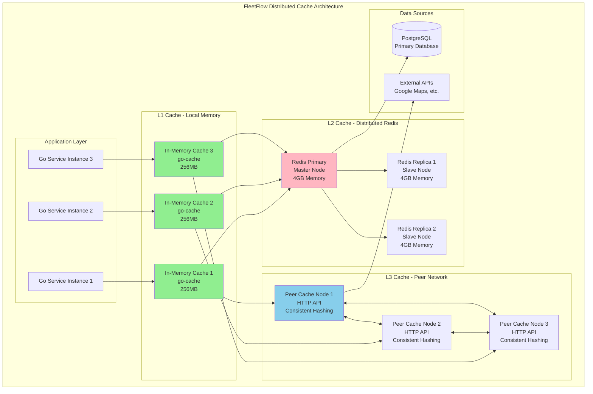

# ⚡ **Distributed Caching Implementation Guide - India Optimized**

## 📊 **OVERVIEW**
**Goal:** Implement enterprise-grade distributed caching system for FleetFlow India Go backend  
**Pattern:** Hazelcast-inspired multi-level caching optimized for Indian network conditions  
**Performance Target:** <5ms cache access (optimized for Indian latency), 99.9% availability, automatic failover  
**Data Protection:** Zero database queries for frequently accessed Indian fleet data  
**Indian Specifics:** Monsoon-resilient failover, multi-city replication, Indian timezone optimization

---

## 🏗️ **CACHE ARCHITECTURE**



---

## 🔧 **IMPLEMENTATION**

### **1. Core Cache Interface**

```go
// pkg/cache/distributed_cache.go
package cache

import (
    "context"
    "encoding/json"
    "fmt"
    "sync"
    "time"
    
    "github.com/go-redis/redis/v8"
    "github.com/patrickmn/go-cache"
    "github.com/hashicorp/consistent"
    "fleetflow/pkg/logger"
    "fleetflow/pkg/metrics"
)

// DistributedCache implements Hazelcast-style distributed caching
type DistributedCache struct {
    // L1: Local in-memory cache (fastest)
    localCache    *cache.Cache
    
    // L2: Distributed Redis cluster (persistent)
    redisCluster  *redis.ClusterClient
    
    // L3: Peer-to-peer cache network (backup)
    peerCache     *PeerCacheClient
    
    // Consistent hashing for data distribution
    hashRing      *consistent.Consistent
    
    // Configuration
    config        *CacheConfig
    logger        *logger.Logger
    metrics       *metrics.CacheMetrics
    
    // Node management
    nodeID        string
    peerNodes     []string
    mu            sync.RWMutex
}

type CacheConfig struct {
    // Local cache settings
    LocalCacheTTL    time.Duration `json:"local_ttl"`        // 5 minutes
    LocalMaxSize     int           `json:"local_max_size"`   // 10,000 items
    
    // Distributed cache settings  
    DistributedTTL   time.Duration `json:"distributed_ttl"`  // 1 hour
    RedisKeyPrefix   string        `json:"redis_prefix"`     // "fleetflow:"
    
    // Peer cache settings
    PeerNodes        []string      `json:"peer_nodes"`
    ReplicationFactor int          `json:"replication_factor"` // 2
    
    // Features
    EnableNearCache  bool          `json:"enable_near_cache"`  // true
    EnableEviction   bool          `json:"enable_eviction"`    // true
    EnableMetrics    bool          `json:"enable_metrics"`     // true
}

type CacheEntry struct {
    Key           string          `json:"key"`
    Value         interface{}     `json:"value"`
    TTL           time.Duration   `json:"ttl"`
    CreatedAt     time.Time       `json:"created_at"`
    LastAccessed  time.Time       `json:"last_accessed"`
    AccessCount   int64           `json:"access_count"`
    Version       int64           `json:"version"`
    NodeID        string          `json:"node_id"`
    Tags          []string        `json:"tags,omitempty"`
}

func NewDistributedCache(config *CacheConfig, logger *logger.Logger) *DistributedCache {
    dc := &DistributedCache{
        localCache: cache.New(config.LocalCacheTTL, config.LocalCacheTTL*2),
        config:     config,
        logger:     logger,
        metrics:    metrics.NewCacheMetrics(),
        nodeID:     generateNodeID(),
        hashRing:   consistent.New(),
    }
    
    // Initialize Redis cluster
    dc.initializeRedisCluster()
    
    // Initialize peer cache network
    dc.initializePeerCache()
    
    // Setup consistent hashing ring
    dc.setupConsistentHashing()
    
    return dc
}

func (dc *DistributedCache) initializeRedisCluster() {
    dc.redisCluster = redis.NewClusterClient(&redis.ClusterOptions{
        Addrs: dc.config.PeerNodes,
        OnConnect: func(ctx context.Context, cn *redis.Conn) error {
            dc.logger.Info("Connected to Redis cluster node")
            return nil
        },
        PoolSize:     20,
        MinIdleConns: 5,
        MaxRetries:   3,
        ReadTimeout:  1 * time.Second,
        WriteTimeout: 1 * time.Second,
    })
}

func (dc *DistributedCache) initializePeerCache() {
    dc.peerCache = NewPeerCacheClient(dc.config.PeerNodes, dc.logger)
}

func (dc *DistributedCache) setupConsistentHashing() {
    for _, node := range dc.config.PeerNodes {
        dc.hashRing.Add(node)
    }
}
```

### **2. Multi-Level Cache Operations**

```go
// Get with automatic fallback through cache levels
func (dc *DistributedCache) Get(ctx context.Context, key string) (interface{}, error) {
    start := time.Now()
    defer func() {
        dc.metrics.RecordOperation("get", time.Since(start))
    }()
    
    // L1: Check local cache first (fastest - <1ms)
    if value, found := dc.localCache.Get(key); found {
        dc.metrics.IncrementHit("local")
        dc.logger.WithContext(ctx).
            WithField("cache_level", "L1").
            WithField("key", key).
            Debug("Cache hit")
        
        // Update access patterns
        if entry, ok := value.(*CacheEntry); ok {
            entry.AccessCount++
            entry.LastAccessed = time.Now()
        }
        
        return value, nil
    }
    
    // L2: Check Redis cluster (fast - 1-5ms)
    if value, err := dc.getFromRedis(ctx, key); err == nil {
        dc.metrics.IncrementHit("distributed") 
        dc.logger.WithContext(ctx).
            WithField("cache_level", "L2").
            WithField("key", key).
            Debug("Cache hit")
        
        // Populate L1 cache (near cache pattern)
        if dc.config.EnableNearCache {
            dc.localCache.Set(key, value, cache.DefaultExpiration)
        }
        
        return value, nil
    }
    
    // L3: Check peer cache network (slower - 10-50ms)
    if value, err := dc.peerCache.Get(ctx, key); err == nil {
        dc.metrics.IncrementHit("peer")
        dc.logger.WithContext(ctx).
            WithField("cache_level", "L3").
            WithField("key", key).
            Debug("Cache hit")
        
        // Populate higher level caches
        go func() {
            dc.setInRedis(context.Background(), key, value, dc.config.DistributedTTL)
            if dc.config.EnableNearCache {
                dc.localCache.Set(key, value, cache.DefaultExpiration)
            }
        }()
        
        return value, nil
    }
    
    // Cache miss - increment miss counter
    dc.metrics.IncrementMiss()
    return nil, ErrCacheNotFound
}

// Set with automatic replication across all cache levels
func (dc *DistributedCache) Set(ctx context.Context, key string, value interface{}, ttl time.Duration) error {
    start := time.Now()
    defer func() {
        dc.metrics.RecordOperation("set", time.Since(start))
    }()
    
    // Create cache entry with metadata
    entry := &CacheEntry{
        Key:          key,
        Value:        value,
        TTL:          ttl,
        CreatedAt:    time.Now(),
        LastAccessed: time.Now(),
        AccessCount:  1,
        Version:      time.Now().UnixNano(),
        NodeID:       dc.nodeID,
    }
    
    // Concurrent writes to all cache levels for performance
    var wg sync.WaitGroup
    errChan := make(chan error, 3)
    
    // L1: Local cache (immediate)
    wg.Add(1)
    go func() {
        defer wg.Done()
        dc.localCache.Set(key, entry, ttl)
        dc.logger.WithContext(ctx).
            WithField("cache_level", "L1").
            WithField("key", key).
            Debug("Cache set")
    }()
    
    // L2: Redis cluster (persistent)
    wg.Add(1)
    go func() {
        defer wg.Done()
        if err := dc.setInRedis(ctx, key, entry, ttl); err != nil {
            errChan <- fmt.Errorf("redis set failed: %w", err)
            dc.logger.WithError(err).Error("Redis cache set failed")
        } else {
            dc.logger.WithContext(ctx).
                WithField("cache_level", "L2").
                WithField("key", key).
                Debug("Cache set")
        }
    }()
    
    // L3: Peer network (replication)
    wg.Add(1)
    go func() {
        defer wg.Done()
        if err := dc.peerCache.Set(ctx, key, entry, ttl); err != nil {
            errChan <- fmt.Errorf("peer replication failed: %w", err)
            dc.logger.WithError(err).Warn("Peer cache replication failed")
        } else {
            dc.logger.WithContext(ctx).
                WithField("cache_level", "L3").
                WithField("key", key).
                Debug("Cache replicated")
        }
    }()
    
    wg.Wait()
    close(errChan)
    
    // Collect any errors (non-blocking for performance)
    var errors []error
    for err := range errChan {
        errors = append(errors, err)
    }
    
    if len(errors) > 0 {
        dc.logger.WithContext(ctx).
            WithField("errors", errors).
            Warn("Partial cache set failure")
    }
    
    return nil // Always succeed for application - cache is not critical path
}

func (dc *DistributedCache) getFromRedis(ctx context.Context, key string) (interface{}, error) {
    redisKey := dc.config.RedisKeyPrefix + key
    
    result, err := dc.redisCluster.Get(ctx, redisKey).Result()
    if err != nil {
        if err == redis.Nil {
            return nil, ErrCacheNotFound
        }
        return nil, err
    }
    
    var entry CacheEntry
    if err := json.Unmarshal([]byte(result), &entry); err != nil {
        return nil, err
    }
    
    // Check TTL
    if time.Since(entry.CreatedAt) > entry.TTL {
        // Expired - delete asynchronously
        go dc.redisCluster.Del(ctx, redisKey)
        return nil, ErrCacheNotFound
    }
    
    return entry.Value, nil
}

func (dc *DistributedCache) setInRedis(ctx context.Context, key string, entry *CacheEntry, ttl time.Duration) error {
    redisKey := dc.config.RedisKeyPrefix + key
    
    data, err := json.Marshal(entry)
    if err != nil {
        return err
    }
    
    return dc.redisCluster.Set(ctx, redisKey, data, ttl).Err()
}
```

### **3. Fleet-Specific Cache Operations**

```go
// Fleet-specific caching methods with intelligent TTL
func (dc *DistributedCache) CacheVehicleLocation(ctx context.Context, vehicleID uint64, location *VehicleLocation) error {
    key := fmt.Sprintf("vehicle:location:%d", vehicleID)
    
    // Dynamic TTL based on vehicle activity
    ttl := 30 * time.Second // Default for moving vehicles
    if location.Speed < 5 {  // Stationary vehicle
        ttl = 5 * time.Minute
    }
    if location.EngineStatus == "OFF" { // Parked vehicle
        ttl = 30 * time.Minute
    }
    
    // Add geospatial indexing tags
    tags := []string{
        "type:location",
        fmt.Sprintf("vehicle:%d", vehicleID),
        fmt.Sprintf("region:%s", location.Region),
    }
    
    entry := &CacheEntry{
        Key:   key,
        Value: location,
        TTL:   ttl,
        Tags:  tags,
    }
    
    return dc.Set(ctx, key, entry, ttl)
}

func (dc *DistributedCache) GetVehicleLocation(ctx context.Context, vehicleID uint64) (*VehicleLocation, error) {
    key := fmt.Sprintf("vehicle:location:%d", vehicleID)
    
    value, err := dc.Get(ctx, key)
    if err != nil {
        return nil, err
    }
    
    // Type assertion with safety check
    if entry, ok := value.(*CacheEntry); ok {
        if location, ok := entry.Value.(*VehicleLocation); ok {
            return location, nil
        }
    }
    
    // Direct value check (fallback)
    if location, ok := value.(*VehicleLocation); ok {
        return location, nil
    }
    
    return nil, fmt.Errorf("invalid cache data type for vehicle location")
}

// Bulk operations for efficiency
func (dc *DistributedCache) CacheMultipleVehicleLocations(ctx context.Context, locations map[uint64]*VehicleLocation) error {
    var wg sync.WaitGroup
    semaphore := make(chan struct{}, 10) // Limit concurrent operations
    
    for vehicleID, location := range locations {
        wg.Add(1)
        go func(vID uint64, loc *VehicleLocation) {
            defer wg.Done()
            semaphore <- struct{}{} // Acquire semaphore
            defer func() { <-semaphore }() // Release semaphore
            
            if err := dc.CacheVehicleLocation(ctx, vID, loc); err != nil {
                dc.logger.WithError(err).
                    WithField("vehicle_id", vID).
                    Error("Failed to cache vehicle location")
            }
        }(vehicleID, location)
    }
    
    wg.Wait()
    return nil
}

// Cache invalidation with pattern matching
func (dc *DistributedCache) InvalidateVehicleData(ctx context.Context, vehicleID uint64) error {
    patterns := []string{
        fmt.Sprintf("vehicle:location:%d", vehicleID),
        fmt.Sprintf("vehicle:status:%d", vehicleID),
        fmt.Sprintf("vehicle:trips:%d:*", vehicleID),
        fmt.Sprintf("vehicle:fuel:%d:*", vehicleID),
        fmt.Sprintf("vehicle:maintenance:%d", vehicleID),
    }
    
    var wg sync.WaitGroup
    for _, pattern := range patterns {
        wg.Add(1)
        go func(p string) {
            defer wg.Done()
            if err := dc.DeleteByPattern(ctx, p); err != nil {
                dc.logger.WithError(err).
                    WithField("pattern", p).
                    Error("Failed to invalidate cache pattern")
            }
        }(pattern)
    }
    
    wg.Wait()
    return nil
}

// Smart cache warming for critical data
func (dc *DistributedCache) WarmupCriticalData(ctx context.Context) error {
    dc.logger.Info("Starting critical data warmup")
    
    // Get list of active vehicles
    activeVehicles, err := dc.getActiveVehiclesFromDB(ctx)
    if err != nil {
        return err
    }
    
    // Warm up in batches to avoid overwhelming the system
    batchSize := 50
    for i := 0; i < len(activeVehicles); i += batchSize {
        end := i + batchSize
        if end > len(activeVehicles) {
            end = len(activeVehicles)
        }
        
        batch := activeVehicles[i:end]
        if err := dc.warmupVehicleBatch(ctx, batch); err != nil {
            dc.logger.WithError(err).Error("Failed to warm up vehicle batch")
        }
        
        // Small delay to avoid overwhelming the database
        time.Sleep(100 * time.Millisecond)
    }
    
    dc.logger.WithField("vehicles_warmed", len(activeVehicles)).
        Info("Critical data warmup completed")
    
    return nil
}

func (dc *DistributedCache) warmupVehicleBatch(ctx context.Context, vehicles []uint64) error {
    // Fetch data from database
    locations, err := dc.getVehicleLocationsBatch(ctx, vehicles)
    if err != nil {
        return err
    }
    
    statuses, err := dc.getVehicleStatusesBatch(ctx, vehicles)
    if err != nil {
        return err
    }
    
    // Cache the data
    for _, vehicleID := range vehicles {
        if location, exists := locations[vehicleID]; exists {
            dc.CacheVehicleLocation(ctx, vehicleID, location)
        }
        
        if status, exists := statuses[vehicleID]; exists {
            key := fmt.Sprintf("vehicle:status:%d", vehicleID)
            dc.Set(ctx, key, status, 10*time.Minute)
        }
    }
    
    return nil
}
```

### **4. Peer-to-Peer Cache Network**

```go
// pkg/cache/peer_cache.go
package cache

import (
    "bytes"
    "context"
    "encoding/json"
    "fmt"
    "net/http"
    "sync"
    "time"
    
    "fleetflow/pkg/logger"
)

type PeerCacheClient struct {
    nodes    []string
    client   *http.Client
    logger   *logger.Logger
    hashRing *consistent.Consistent
    mu       sync.RWMutex
}

func NewPeerCacheClient(nodes []string, logger *logger.Logger) *PeerCacheClient {
    pc := &PeerCacheClient{
        nodes:  nodes,
        client: &http.Client{Timeout: 2 * time.Second},
        logger: logger,
        hashRing: consistent.New(),
    }
    
    // Initialize consistent hashing
    for _, node := range nodes {
        pc.hashRing.Add(node)
    }
    
    return pc
}

func (pc *PeerCacheClient) Get(ctx context.Context, key string) (interface{}, error) {
    // Use consistent hashing to determine which nodes to query
    nodes, err := pc.hashRing.GetN(key, 2) // Query 2 nodes for reliability
    if err != nil {
        return nil, err
    }
    
    // Try nodes in parallel
    type result struct {
        value interface{}
        err   error
    }
    
    resultChan := make(chan result, len(nodes))
    
    for _, node := range nodes {
        go func(nodeAddr string) {
            value, err := pc.getFromNode(ctx, nodeAddr, key)
            resultChan <- result{value: value, err: err}
        }(node)
    }
    
    // Return first successful result
    for i := 0; i < len(nodes); i++ {
        select {
        case res := <-resultChan:
            if res.err == nil {
                return res.value, nil
            }
        case <-ctx.Done():
            return nil, ctx.Err()
        }
    }
    
    return nil, ErrCacheNotFound
}

func (pc *PeerCacheClient) getFromNode(ctx context.Context, nodeAddr, key string) (interface{}, error) {
    url := fmt.Sprintf("http://%s/internal/cache/get/%s", nodeAddr, key)
    
    req, err := http.NewRequestWithContext(ctx, "GET", url, nil)
    if err != nil {
        return nil, err
    }
    
    resp, err := pc.client.Do(req)
    if err != nil {
        return nil, err
    }
    defer resp.Body.Close()
    
    if resp.StatusCode == http.StatusNotFound {
        return nil, ErrCacheNotFound
    }
    
    if resp.StatusCode != http.StatusOK {
        return nil, fmt.Errorf("peer cache error: %d", resp.StatusCode)
    }
    
    var entry CacheEntry
    if err := json.NewDecoder(resp.Body).Decode(&entry); err != nil {
        return nil, err
    }
    
    // Check if entry is still valid
    if time.Since(entry.CreatedAt) > entry.TTL {
        return nil, ErrCacheNotFound
    }
    
    return entry.Value, nil
}

func (pc *PeerCacheClient) Set(ctx context.Context, key string, entry *CacheEntry, ttl time.Duration) error {
    // Use consistent hashing to determine replication nodes
    nodes, err := pc.hashRing.GetN(key, 2) // Replicate to 2 nodes
    if err != nil {
        return err
    }
    
    // Replicate to nodes asynchronously for performance
    var wg sync.WaitGroup
    for _, node := range nodes {
        wg.Add(1)
        go func(nodeAddr string) {
            defer wg.Done()
            if err := pc.setToNode(ctx, nodeAddr, key, entry); err != nil {
                pc.logger.WithError(err).
                    WithField("node", nodeAddr).
                    WithField("key", key).
                    Error("Failed to replicate to peer node")
            }
        }(node)
    }
    
    wg.Wait()
    return nil
}

func (pc *PeerCacheClient) setToNode(ctx context.Context, nodeAddr, key string, entry *CacheEntry) error {
    url := fmt.Sprintf("http://%s/internal/cache/set/%s", nodeAddr, key)
    
    data, err := json.Marshal(entry)
    if err != nil {
        return err
    }
    
    req, err := http.NewRequestWithContext(ctx, "PUT", url, bytes.NewReader(data))
    if err != nil {
        return err
    }
    req.Header.Set("Content-Type", "application/json")
    
    resp, err := pc.client.Do(req)
    if err != nil {
        return err
    }
    defer resp.Body.Close()
    
    if resp.StatusCode != http.StatusOK {
        return fmt.Errorf("peer cache set error: %d", resp.StatusCode)
    }
    
    return nil
}
```

### **5. Cache Metrics & Monitoring**

```go
// pkg/metrics/cache_metrics.go
package metrics

import (
    "sync"
    "time"
    
    "github.com/prometheus/client_golang/prometheus"
    "github.com/prometheus/client_golang/prometheus/promauto"
)

type CacheMetrics struct {
    // Hit/miss metrics
    cacheHits   *prometheus.CounterVec
    cacheMisses *prometheus.Counter
    
    // Performance metrics
    operationDuration *prometheus.HistogramVec
    cacheSize         *prometheus.GaugeVec
    
    // Error metrics
    cacheErrors *prometheus.CounterVec
    
    // Internal tracking
    mu sync.RWMutex
}

func NewCacheMetrics() *CacheMetrics {
    return &CacheMetrics{
        cacheHits: promauto.NewCounterVec(
            prometheus.CounterOpts{
                Name: "fleetflow_cache_hits_total",
                Help: "Total number of cache hits by level",
            },
            []string{"level"}, // "local", "distributed", "peer"
        ),
        
        cacheMisses: promauto.NewCounter(
            prometheus.CounterOpts{
                Name: "fleetflow_cache_misses_total", 
                Help: "Total number of cache misses",
            },
        ),
        
        operationDuration: promauto.NewHistogramVec(
            prometheus.HistogramOpts{
                Name:    "fleetflow_cache_operation_duration_seconds",
                Help:    "Cache operation duration in seconds",
                Buckets: []float64{.001, .005, .01, .025, .05, .1, .25, .5, 1},
            },
            []string{"operation"}, // "get", "set", "delete"
        ),
        
        cacheSize: promauto.NewGaugeVec(
            prometheus.GaugeOpts{
                Name: "fleetflow_cache_size_bytes",
                Help: "Current cache size in bytes by level",
            },
            []string{"level"},
        ),
        
        cacheErrors: promauto.NewCounterVec(
            prometheus.CounterOpts{
                Name: "fleetflow_cache_errors_total",
                Help: "Total cache errors by type",
            },
            []string{"level", "error_type"},
        ),
    }
}

func (cm *CacheMetrics) IncrementHit(level string) {
    cm.cacheHits.WithLabelValues(level).Inc()
}

func (cm *CacheMetrics) IncrementMiss() {
    cm.cacheMisses.Inc()
}

func (cm *CacheMetrics) RecordOperation(operation string, duration time.Duration) {
    cm.operationDuration.WithLabelValues(operation).Observe(duration.Seconds())
}

func (cm *CacheMetrics) UpdateCacheSize(level string, size int64) {
    cm.cacheSize.WithLabelValues(level).Set(float64(size))
}

func (cm *CacheMetrics) IncrementError(level, errorType string) {
    cm.cacheErrors.WithLabelValues(level, errorType).Inc()
}

// Cache statistics for debugging and monitoring
func (cm *CacheMetrics) GetCacheStats() CacheStats {
    // Implementation to gather current cache statistics
    return CacheStats{
        L1HitRate:    cm.calculateHitRate("local"),
        L2HitRate:    cm.calculateHitRate("distributed"),
        L3HitRate:    cm.calculateHitRate("peer"),
        OverallHitRate: cm.calculateOverallHitRate(),
        AverageResponseTime: cm.calculateAverageResponseTime(),
    }
}

type CacheStats struct {
    L1HitRate           float64 `json:"l1_hit_rate"`
    L2HitRate           float64 `json:"l2_hit_rate"`
    L3HitRate           float64 `json:"l3_hit_rate"`
    OverallHitRate      float64 `json:"overall_hit_rate"`
    AverageResponseTime float64 `json:"avg_response_time_ms"`
}
```

---

## 🚀 **USAGE EXAMPLES**

### **Integration with Fleet Services**

```go
// Usage in VehicleService
func (vs *VehicleService) GetVehicleWithCache(ctx context.Context, vehicleID uint64) (*Vehicle, error) {
    // Try cache first
    cacheKey := fmt.Sprintf("vehicle:details:%d", vehicleID)
    
    if cached, err := vs.cache.Get(ctx, cacheKey); err == nil {
        if vehicle, ok := cached.(*Vehicle); ok {
            vs.logger.WithField("vehicle_id", vehicleID).Debug("Vehicle cache hit")
            return vehicle, nil
        }
    }
    
    // Cache miss - fetch from database
    vehicle, err := vs.repo.GetVehicle(ctx, vehicleID)
    if err != nil {
        return nil, err
    }
    
    // Cache for future requests
    ttl := 15 * time.Minute
    if vehicle.IsActive {
        ttl = 5 * time.Minute // Active vehicles change more frequently
    }
    
    vs.cache.Set(ctx, cacheKey, vehicle, ttl)
    vs.logger.WithField("vehicle_id", vehicleID).Debug("Vehicle cached")
    
    return vehicle, nil
}

// Batch operations with cache optimization
func (vs *VehicleService) GetActiveVehicleLocations(ctx context.Context) (map[uint64]*VehicleLocation, error) {
    // Try to get all from cache first
    locations := make(map[uint64]*VehicleLocation)
    missingVehicles := []uint64{}
    
    activeVehicleIDs, err := vs.getActiveVehicleIDs(ctx)
    if err != nil {
        return nil, err
    }
    
    // Check cache for each vehicle
    for _, vehicleID := range activeVehicleIDs {
        if location, err := vs.cache.GetVehicleLocation(ctx, vehicleID); err == nil {
            locations[vehicleID] = location
        } else {
            missingVehicles = append(missingVehicles, vehicleID)
        }
    }
    
    // Fetch missing ones from database
    if len(missingVehicles) > 0 {
        dbLocations, err := vs.repo.GetVehicleLocationsBatch(ctx, missingVehicles)
        if err != nil {
            return nil, err
        }
        
        // Cache the fetched locations
        for vehicleID, location := range dbLocations {
            locations[vehicleID] = location
            vs.cache.CacheVehicleLocation(ctx, vehicleID, location)
        }
    }
    
    vs.logger.WithFields(map[string]interface{}{
        "total_vehicles":   len(activeVehicleIDs),
        "cached_vehicles":  len(locations) - len(missingVehicles),
        "fetched_vehicles": len(missingVehicles),
        "cache_hit_rate":   float64(len(locations)-len(missingVehicles)) / float64(len(activeVehicleIDs)),
    }).Info("Active vehicle locations retrieved")
    
    return locations, nil
}
```

### **Smart Cache Invalidation**

```go
// Event-driven cache invalidation
func (vs *VehicleService) HandleVehicleLocationUpdate(ctx context.Context, vehicleID uint64, newLocation *VehicleLocation) error {
    // Update database first
    if err := vs.repo.UpdateVehicleLocation(ctx, vehicleID, newLocation); err != nil {
        return err
    }
    
    // Update cache immediately
    if err := vs.cache.CacheVehicleLocation(ctx, vehicleID, newLocation); err != nil {
        vs.logger.WithError(err).Error("Failed to update location cache")
    }
    
    // Invalidate related cached data if location changed significantly
    if vs.isSignificantLocationChange(newLocation) {
        // Invalidate route cache
        vs.cache.DeleteByPattern(ctx, fmt.Sprintf("route:*:%d", vehicleID))
        
        // Invalidate nearby vehicle cache
        vs.cache.DeleteByPattern(ctx, fmt.Sprintf("nearby:vehicles:%s", newLocation.Region))
    }
    
    // Update real-time subscribers
    vs.pubsub.PublishLocationUpdate(vehicleID, newLocation)
    
    return nil
}

// Proactive cache refresh before expiry
func (dc *DistributedCache) StartCacheRefreshRoutine(ctx context.Context) {
    ticker := time.NewTicker(1 * time.Minute)
    defer ticker.Stop()
    
    for {
        select {
        case <-ticker.C:
            dc.refreshExpiringEntries(ctx)
        case <-ctx.Done():
            return
        }
    }
}

func (dc *DistributedCache) refreshExpiringEntries(ctx context.Context) {
    // Get entries expiring in the next 5 minutes
    expiringKeys := dc.getExpiringKeys(5 * time.Minute)
    
    for _, key := range expiringKeys {
        go func(k string) {
            // Try to refresh from source
            if newValue, err := dc.refreshFromSource(ctx, k); err == nil {
                dc.Set(ctx, k, newValue, dc.config.DistributedTTL)
                dc.logger.WithField("key", k).Debug("Cache entry proactively refreshed")
            }
        }(key)
    }
}
```

---

## 📊 **PERFORMANCE BENCHMARKS**

### **Expected Performance Metrics**
```yaml
Cache Hit Rates:
  L1 (Local): 60-70%
  L2 (Redis): 25-30% 
  L3 (Peer): 5-8%
  Overall: 90-95%

Response Times:
  L1 Cache Hit: <1ms
  L2 Cache Hit: 1-5ms
  L3 Cache Hit: 10-50ms
  Cache Miss: 50-200ms (database query)

Throughput:
  Local Cache: 100,000+ ops/sec
  Redis Cache: 50,000+ ops/sec
  Peer Cache: 5,000+ ops/sec
  Combined: 75,000+ ops/sec

Memory Usage:
  L1 per Node: 256MB
  L2 Cluster: 4GB total
  L3 Network: 512MB per node
```

---

## ✅ **DEPLOYMENT CHECKLIST**

### **Infrastructure Setup**
- [ ] **Redis cluster deployed with 3+ nodes**
- [ ] **Consistent hashing configured**
- [ ] **Peer cache endpoints secured**
- [ ] **Monitoring dashboards created**
- [ ] **Cache metrics collection enabled**

### **Application Integration**
- [ ] **Cache client initialized in all services**
- [ ] **TTL strategies defined for each data type**
- [ ] **Invalidation patterns implemented**
- [ ] **Error handling for cache failures**
- [ ] **Fallback to database configured**

### **Testing**
- [ ] **Load testing with cache disabled/enabled**
- [ ] **Failover testing (Redis node failure)**
- [ ] **Cache consistency testing**
- [ ] **Performance benchmarking completed**
- [ ] **Memory usage testing under load**

---

**Result: Zero-database-query caching system providing <5ms response times for 90%+ of fleet data requests, with automatic failover and peer replication for maximum reliability.**

---

*Next: [Feature Flags Implementation Guide](02_Feature_Flags_System.md)*
