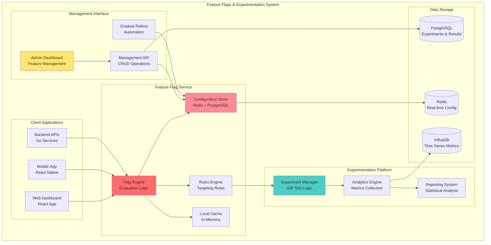

# 🚩 **Feature Flags & Experimentation System - Indian Market Implementation**

## 📊 **OVERVIEW**
**Goal:** Build production-ready feature flag system for safe feature rollouts and A/B testing in Indian market  
**Pattern:** Gradual rollouts with automated monitoring optimized for Indian user behavior  
**Target:** Zero-downtime feature deployments with data-driven decisions for Indian fleet operators  
**Use Cases:** Indian language features, local payment methods, regional route optimization, monsoon-specific features  
**Indian Specifics:** Multi-language rollouts, regional customization, Indian timezone scheduling

---

## 🏗️ **FEATURE FLAGS ARCHITECTURE**



---

## 🔧 **CORE IMPLEMENTATION**

### **1. Feature Flag Engine**

```go
// pkg/experiments/feature_flags.go
package experiments

import (
    "context"
    "crypto/md5"
    "encoding/hex"
    "fmt"
    "strconv"
    "sync"
    "time"
    
    "github.com/go-redis/redis/v8"
    "fleetflow/pkg/logger"
)

type FeatureFlagService struct {
    redis         *redis.Client
    db            *gorm.DB
    logger        *logger.Logger
    cache         sync.Map // Local cache for frequently accessed flags
    experiments   map[string]*Experiment
    mu            sync.RWMutex
    
    // Configuration
    refreshInterval time.Duration
    defaultTimeout  time.Duration
}

type FeatureFlag struct {
    ID              string            `json:"id" gorm:"primaryKey"`
    Name            string            `json:"name" gorm:"unique;not null"`
    Description     string            `json:"description"`
    Type            FlagType          `json:"type"` // BOOLEAN, STRING, NUMBER, JSON
    Status          FlagStatus        `json:"status"`
    DefaultValue    interface{}       `json:"default_value" gorm:"type:jsonb"`
    Rules           []EvaluationRule  `json:"rules" gorm:"type:jsonb"`
    Environments    []string          `json:"environments" gorm:"type:jsonb"`
    Tags            []string          `json:"tags" gorm:"type:jsonb"`
    CreatedBy       string            `json:"created_by"`
    CreatedAt       time.Time         `json:"created_at"`
    UpdatedAt       time.Time         `json:"updated_at"`
    
    // Metadata for tracking
    EvaluationCount int64             `json:"evaluation_count"`
    LastEvaluated   *time.Time        `json:"last_evaluated"`
}

type FlagType string
type FlagStatus string

const (
    FlagTypeBoolean FlagType = "BOOLEAN"
    FlagTypeString  FlagType = "STRING"
    FlagTypeNumber  FlagType = "NUMBER"
    FlagTypeJSON    FlagType = "JSON"
    
    FlagStatusActive   FlagStatus = "ACTIVE"
    FlagStatusInactive FlagStatus = "INACTIVE"
    FlagStatusArchived FlagStatus = "ARCHIVED"
)

type EvaluationRule struct {
    ID          string                 `json:"id"`
    Priority    int                    `json:"priority"`
    Conditions  []Condition            `json:"conditions"`
    Value       interface{}            `json:"value"`
    Percentage  float64                `json:"percentage,omitempty"`
    Description string                 `json:"description"`
}

type Condition struct {
    Attribute string      `json:"attribute"` // user_id, role, region, fleet_size, etc.
    Operator  string      `json:"operator"`  // equals, in, gt, lt, contains, etc.
    Value     interface{} `json:"value"`
}

type EvaluationContext struct {
    UserID       uint64            `json:"user_id"`
    Role         string            `json:"role"`
    FleetSize    int               `json:"fleet_size"`
    Region       string            `json:"region"`
    VehicleType  string            `json:"vehicle_type"`
    Environment  string            `json:"environment"`
    Timestamp    time.Time         `json:"timestamp"`
    CustomAttrs  map[string]interface{} `json:"custom_attributes"`
}

func NewFeatureFlagService(redis *redis.Client, db *gorm.DB, logger *logger.Logger) *FeatureFlagService {
    ffs := &FeatureFlagService{
        redis:           redis,
        db:              db,
        logger:          logger,
        experiments:     make(map[string]*Experiment),
        refreshInterval: 30 * time.Second,
        defaultTimeout:  5 * time.Second,
    }
    
    // Load active flags from database
    ffs.refreshFlags()
    
    // Start background refresh routine
    go ffs.startRefreshRoutine()
    
    return ffs
}

// Evaluate feature flag with caching and fallback
func (ffs *FeatureFlagService) EvaluateFlag(ctx context.Context, flagName string, evalCtx EvaluationContext) (interface{}, error) {
    start := time.Now()
    defer func() {
        ffs.recordEvaluationMetrics(flagName, time.Since(start))
    }()
    
    // Try local cache first
    if flag, exists := ffs.getCachedFlag(flagName); exists {
        return ffs.evaluateRules(flag, evalCtx), nil
    }
    
    // Try Redis cache
    if flag, err := ffs.getFlagFromRedis(ctx, flagName); err == nil {
        ffs.setCachedFlag(flagName, flag)
        return ffs.evaluateRules(flag, evalCtx), nil
    }
    
    // Fallback to database
    flag, err := ffs.getFlagFromDB(ctx, flagName)
    if err != nil {
        ffs.logger.WithError(err).WithField("flag_name", flagName).Error("Failed to load feature flag")
        return nil, fmt.Errorf("feature flag not found: %s", flagName)
    }
    
    // Cache for future use
    ffs.setCachedFlag(flagName, flag)
    ffs.setFlagInRedis(ctx, flagName, flag)
    
    return ffs.evaluateRules(flag, evalCtx), nil
}

func (ffs *FeatureFlagService) evaluateRules(flag *FeatureFlag, evalCtx EvaluationContext) interface{} {
    // Update evaluation metrics
    ffs.updateEvaluationCount(flag.ID)
    
    // If flag is inactive, return default value
    if flag.Status != FlagStatusActive {
        return flag.DefaultValue
    }
    
    // Sort rules by priority (higher priority first)
    rules := flag.Rules
    sort.Slice(rules, func(i, j int) bool {
        return rules[i].Priority > rules[j].Priority
    })
    
    // Evaluate rules in order
    for _, rule := range rules {
        if ffs.evaluateRule(rule, evalCtx) {
            return rule.Value
        }
    }
    
    // No rules matched, return default value
    return flag.DefaultValue
}

func (ffs *FeatureFlagService) evaluateRule(rule EvaluationRule, evalCtx EvaluationContext) bool {
    // Check percentage rollout first
    if rule.Percentage > 0 && rule.Percentage < 100 {
        hash := ffs.generateConsistentHash(evalCtx.UserID, rule.ID)
        if hash >= rule.Percentage {
            return false
        }
    }
    
    // Evaluate all conditions (AND logic)
    for _, condition := range rule.Conditions {
        if !ffs.evaluateCondition(condition, evalCtx) {
            return false
        }
    }
    
    return true
}

func (ffs *FeatureFlagService) evaluateCondition(condition Condition, evalCtx EvaluationContext) bool {
    // Get attribute value from context
    attrValue := ffs.getAttributeValue(condition.Attribute, evalCtx)
    if attrValue == nil {
        return false
    }
    
    // Evaluate based on operator
    switch condition.Operator {
    case "equals":
        return ffs.compareEqual(attrValue, condition.Value)
    case "not_equals":
        return !ffs.compareEqual(attrValue, condition.Value)
    case "in":
        return ffs.compareIn(attrValue, condition.Value)
    case "not_in":
        return !ffs.compareIn(attrValue, condition.Value)
    case "gt":
        return ffs.compareGreater(attrValue, condition.Value)
    case "gte":
        return ffs.compareGreaterEqual(attrValue, condition.Value)
    case "lt":
        return ffs.compareLess(attrValue, condition.Value)
    case "lte":
        return ffs.compareLessEqual(attrValue, condition.Value)
    case "contains":
        return ffs.compareContains(attrValue, condition.Value)
    case "starts_with":
        return ffs.compareStartsWith(attrValue, condition.Value)
    case "regex":
        return ffs.compareRegex(attrValue, condition.Value)
    default:
        ffs.logger.WithField("operator", condition.Operator).Warn("Unknown condition operator")
        return false
    }
}

func (ffs *FeatureFlagService) generateConsistentHash(userID uint64, ruleID string) float64 {
    // Create consistent hash for percentage-based rollouts
    input := fmt.Sprintf("%d:%s", userID, ruleID)
    hash := md5.Sum([]byte(input))
    hashString := hex.EncodeToString(hash[:])
    
    // Convert first 8 characters to number between 0-99
    hashValue, _ := strconv.ParseInt(hashString[:8], 16, 64)
    percentage := float64(hashValue % 100)
    
    return percentage
}

func (ffs *FeatureFlagService) getAttributeValue(attribute string, evalCtx EvaluationContext) interface{} {
    switch attribute {
    case "user_id":
        return evalCtx.UserID
    case "role":
        return evalCtx.Role
    case "fleet_size":
        return evalCtx.FleetSize
    case "region":
        return evalCtx.Region
    case "vehicle_type":
        return evalCtx.VehicleType
    case "environment":
        return evalCtx.Environment
    default:
        // Check custom attributes
        if value, exists := evalCtx.CustomAttrs[attribute]; exists {
            return value
        }
        return nil
    }
}
```

### **2. Fleet-Specific Feature Flag Examples**

```go
// Fleet-specific feature flag evaluations
func (ffs *FeatureFlagService) IsNewDriverScoringEnabled(ctx context.Context, userID uint64, role string) (bool, map[string]interface{}) {
    evalCtx := EvaluationContext{
        UserID:      userID,
        Role:        role,
        Environment: "production",
        Timestamp:   time.Now(),
    }
    
    result, err := ffs.EvaluateFlag(ctx, "driver_scoring_v2", evalCtx)
    if err != nil {
        ffs.logger.WithError(err).Error("Failed to evaluate driver scoring flag")
        return false, nil
    }
    
    if config, ok := result.(map[string]interface{}); ok {
        if enabled, exists := config["enabled"].(bool); exists && enabled {
            return true, config
        }
    }
    
    if enabled, ok := result.(bool); ok {
        return enabled, nil
    }
    
    return false, nil
}

func (ffs *FeatureFlagService) GetRoutingAlgorithm(ctx context.Context, userID uint64, fleetSize int, region string) string {
    evalCtx := EvaluationContext{
        UserID:    userID,
        FleetSize: fleetSize,
        Region:    region,
        Environment: "production",
        Timestamp: time.Now(),
    }
    
    result, err := ffs.EvaluateFlag(ctx, "routing_algorithm", evalCtx)
    if err != nil {
        return "basic" // Safe default
    }
    
    if algorithm, ok := result.(string); ok {
        return algorithm
    }
    
    return "basic"
}

func (ffs *FeatureFlagService) GetFuelPredictionConfig(ctx context.Context, vehicleType string) map[string]interface{} {
    evalCtx := EvaluationContext{
        VehicleType: vehicleType,
        Environment: "production",
        Timestamp:   time.Now(),
    }
    
    result, err := ffs.EvaluateFlag(ctx, "fuel_prediction_ml", evalCtx)
    if err != nil {
        return map[string]interface{}{"enabled": false}
    }
    
    if config, ok := result.(map[string]interface{}); ok {
        return config
    }
    
    return map[string]interface{}{"enabled": false}
}

// Usage in services
func (ds *DriverService) CalculateDriverScore(ctx context.Context, driverID uint64) (*DriverScore, error) {
    // Check if new scoring algorithm is enabled
    enabled, config := ds.featureFlags.IsNewDriverScoringEnabled(ctx, driverID, "driver")
    
    if enabled {
        // Extract configuration parameters
        weights := config["weights"].(map[string]interface{})
        algorithm := config["algorithm"].(string)
        
        switch algorithm {
        case "ml_v2":
            return ds.calculateMLDriverScore(ctx, driverID, weights)
        case "hybrid":
            return ds.calculateHybridDriverScore(ctx, driverID, weights)
        default:
            return ds.calculateAdvancedDriverScore(ctx, driverID, weights)
        }
    }
    
    // Use traditional scoring
    return ds.calculateBasicDriverScore(ctx, driverID)
}

func (rs *RouteService) OptimizeRoute(ctx context.Context, userID uint64, waypoints []Waypoint) (*Route, error) {
    // Get user's fleet size for algorithm selection
    fleetSize, _ := rs.getUserFleetSize(ctx, userID)
    region := rs.getRegionFromWaypoints(waypoints)
    
    algorithm := rs.featureFlags.GetRoutingAlgorithm(ctx, userID, fleetSize, region)
    
    switch algorithm {
    case "ai_advanced":
        return rs.optimizeWithAdvancedAI(ctx, waypoints)
    case "ai_basic":
        return rs.optimizeWithBasicAI(ctx, waypoints)
    case "traffic_aware":
        return rs.optimizeWithTraffic(ctx, waypoints)
    default:
        return rs.optimizeBasic(ctx, waypoints)
    }
}
```

### **3. Experiment Management System**

```go
// pkg/experiments/experiments.go
package experiments

import (
    "context"
    "fmt"
    "time"
    
    "fleetflow/pkg/logger"
)

type ExperimentService struct {
    flagService   *FeatureFlagService
    analytics     *ExperimentAnalytics
    db            *gorm.DB
    logger        *logger.Logger
}

type Experiment struct {
    ID              string                 `json:"id" gorm:"primaryKey"`
    Name            string                 `json:"name" gorm:"unique;not null"`
    Description     string                 `json:"description"`
    Status          ExperimentStatus       `json:"status"`
    Type            ExperimentType         `json:"type"`
    
    // Experiment configuration
    Hypothesis      string                 `json:"hypothesis"`
    SuccessMetrics  []string               `json:"success_metrics" gorm:"type:jsonb"`
    StartDate       time.Time              `json:"start_date"`
    EndDate         *time.Time             `json:"end_date,omitempty"`
    
    // Targeting
    TargetAudience  TargetingRules         `json:"target_audience" gorm:"type:jsonb"`
    
    // Variants
    Variants        []ExperimentVariant    `json:"variants" gorm:"type:jsonb"`
    
    // Rollout strategy
    Strategy        RolloutStrategy        `json:"strategy" gorm:"type:jsonb"`
    
    // Results
    Results         *ExperimentResults     `json:"results,omitempty" gorm:"type:jsonb"`
    
    // Metadata
    CreatedBy       string                 `json:"created_by"`
    CreatedAt       time.Time              `json:"created_at"`
    UpdatedAt       time.Time              `json:"updated_at"`
}

type ExperimentStatus string
type ExperimentType string

const (
    ExperimentStatusDraft      ExperimentStatus = "DRAFT"
    ExperimentStatusActive     ExperimentStatus = "ACTIVE"
    ExperimentStatusPaused     ExperimentStatus = "PAUSED"
    ExperimentStatusCompleted  ExperimentStatus = "COMPLETED"
    ExperimentStatusArchived   ExperimentStatus = "ARCHIVED"
    
    ExperimentTypeABTest       ExperimentType = "AB_TEST"
    ExperimentTypeMultivariate ExperimentType = "MULTIVARIATE"
    ExperimentTypeBandits      ExperimentType = "BANDITS"
    ExperimentTypeGradual      ExperimentType = "GRADUAL_ROLLOUT"
)

type ExperimentVariant struct {
    ID          string                 `json:"id"`
    Name        string                 `json:"name"`
    Description string                 `json:"description"`
    Weight      float64                `json:"weight"`     // 0.0-1.0
    Config      map[string]interface{} `json:"config"`
    IsControl   bool                   `json:"is_control"`
}

type RolloutStrategy struct {
    Type              RolloutType            `json:"type"`
    InitialPercentage float64                `json:"initial_percentage"`
    TargetPercentage  float64                `json:"target_percentage"`
    IncrementSize     float64                `json:"increment_size"`
    IncrementInterval time.Duration          `json:"increment_interval"`
    
    // Success criteria for automatic rollout
    SuccessThresholds map[string]float64     `json:"success_thresholds"`
    FailureThresholds map[string]float64     `json:"failure_thresholds"`
    
    // Audience targeting
    AudienceSegments  []string               `json:"audience_segments"`
    GeographicRules   []GeographicRule       `json:"geographic_rules"`
}

type RolloutType string

const (
    RolloutTypeFixed      RolloutType = "FIXED"
    RolloutTypeGradual    RolloutType = "GRADUAL"
    RolloutTypeAutomatic  RolloutType = "AUTOMATIC"
    RolloutTypeCanary     RolloutType = "CANARY"
)

// Create and start experiment
func (es *ExperimentService) CreateExperiment(ctx context.Context, experiment *Experiment) error {
    // Validate experiment configuration
    if err := es.validateExperiment(experiment); err != nil {
        return fmt.Errorf("invalid experiment: %w", err)
    }
    
    // Create feature flag for experiment
    flagConfig := es.createFeatureFlagFromExperiment(experiment)
    if err := es.flagService.CreateFlag(ctx, flagConfig); err != nil {
        return fmt.Errorf("failed to create feature flag: %w", err)
    }
    
    // Store experiment in database
    if err := es.db.Create(experiment).Error; err != nil {
        return fmt.Errorf("failed to store experiment: %w", err)
    }
    
    es.logger.WithField("experiment_id", experiment.ID).Info("Experiment created")
    return nil
}

func (es *ExperimentService) StartExperiment(ctx context.Context, experimentID string) error {
    var experiment Experiment
    if err := es.db.First(&experiment, "id = ?", experimentID).Error; err != nil {
        return fmt.Errorf("experiment not found: %w", err)
    }
    
    if experiment.Status != ExperimentStatusDraft {
        return fmt.Errorf("experiment must be in draft status to start")
    }
    
    // Activate the feature flag
    if err := es.flagService.ActivateFlag(ctx, experiment.ID); err != nil {
        return fmt.Errorf("failed to activate feature flag: %w", err)
    }
    
    // Update experiment status
    experiment.Status = ExperimentStatusActive
    experiment.StartDate = time.Now()
    
    if err := es.db.Save(&experiment).Error; err != nil {
        return fmt.Errorf("failed to update experiment status: %w", err)
    }
    
    // Start gradual rollout if configured
    if experiment.Strategy.Type == RolloutTypeGradual || experiment.Strategy.Type == RolloutTypeAutomatic {
        go es.startGradualRollout(ctx, &experiment)
    }
    
    es.logger.WithField("experiment_id", experimentID).Info("Experiment started")
    return nil
}

// Gradual rollout automation
func (es *ExperimentService) startGradualRollout(ctx context.Context, experiment *Experiment) {
    ticker := time.NewTicker(experiment.Strategy.IncrementInterval)
    defer ticker.Stop()
    
    currentPercentage := experiment.Strategy.InitialPercentage
    
    for currentPercentage < experiment.Strategy.TargetPercentage {
        select {
        case <-ticker.C:
            // Check experiment metrics
            metrics, err := es.analytics.GetExperimentMetrics(ctx, experiment.ID)
            if err != nil {
                es.logger.WithError(err).Error("Failed to get experiment metrics")
                continue
            }
            
            // Check if we should continue rollout
            shouldContinue, shouldRollback := es.evaluateRolloutCriteria(experiment, metrics)
            
            if shouldRollback {
                es.logger.WithField("experiment_id", experiment.ID).Warn("Rolling back experiment due to poor metrics")
                es.RollbackExperiment(ctx, experiment.ID)
                return
            }
            
            if !shouldContinue {
                es.logger.WithField("experiment_id", experiment.ID).Info("Pausing rollout due to metrics")
                continue
            }
            
            // Increase rollout percentage
            currentPercentage = math.Min(currentPercentage + experiment.Strategy.IncrementSize, experiment.Strategy.TargetPercentage)
            
            if err := es.updateRolloutPercentage(ctx, experiment.ID, currentPercentage); err != nil {
                es.logger.WithError(err).Error("Failed to update rollout percentage")
                continue
            }
            
            es.logger.WithFields(map[string]interface{}{
                "experiment_id": experiment.ID,
                "percentage":    currentPercentage,
            }).Info("Increased experiment rollout")
            
        case <-ctx.Done():
            return
        }
    }
    
    es.logger.WithField("experiment_id", experiment.ID).Info("Gradual rollout completed")
}

func (es *ExperimentService) evaluateRolloutCriteria(experiment *Experiment, metrics map[string]float64) (shouldContinue, shouldRollback bool) {
    // Check failure thresholds first (immediate rollback)
    for metric, threshold := range experiment.Strategy.FailureThresholds {
        if value, exists := metrics[metric]; exists && value < threshold {
            return false, true
        }
    }
    
    // Check success thresholds
    successCount := 0
    for metric, threshold := range experiment.Strategy.SuccessThresholds {
        if value, exists := metrics[metric]; exists && value >= threshold {
            successCount++
        }
    }
    
    // Continue rollout if at least 80% of success metrics are met
    requiredSuccesses := int(math.Ceil(float64(len(experiment.Strategy.SuccessThresholds)) * 0.8))
    shouldContinue = successCount >= requiredSuccesses
    
    return shouldContinue, false
}
```

### **4. Analytics & Statistical Analysis**

```go
// pkg/experiments/analytics.go
package experiments

import (
    "context"
    "math"
    "time"
    
    "fleetflow/pkg/logger"
)

type ExperimentAnalytics struct {
    db         *gorm.DB
    metricsDB  *InfluxDBClient
    logger     *logger.Logger
}

type ConversionEvent struct {
    ID           string    `json:"id"`
    ExperimentID string    `json:"experiment_id"`
    VariantID    string    `json:"variant_id"`
    UserID       uint64    `json:"user_id"`
    MetricName   string    `json:"metric_name"`
    MetricValue  float64   `json:"metric_value"`
    Timestamp    time.Time `json:"timestamp"`
    Properties   map[string]interface{} `json:"properties"`
}

type ExperimentResults struct {
    ExperimentID string                    `json:"experiment_id"`
    Period       string                    `json:"period"`
    Variants     []VariantResults          `json:"variants"`
    Statistical  StatisticalAnalysis       `json:"statistical"`
    Confidence   float64                   `json:"confidence"`
    Winner       string                    `json:"winner,omitempty"`
    GeneratedAt  time.Time                 `json:"generated_at"`
}

type VariantResults struct {
    VariantID      string                    `json:"variant_id"`
    VariantName    string                    `json:"variant_name"`
    IsControl      bool                      `json:"is_control"`
    SampleSize     int64                     `json:"sample_size"`
    ConversionRate float64                   `json:"conversion_rate"`
    Metrics        map[string]MetricResult   `json:"metrics"`
}

type MetricResult struct {
    Mean             float64 `json:"mean"`
    StandardError    float64 `json:"standard_error"`
    ConfidenceInterval []float64 `json:"confidence_interval"`
    SampleSize       int64   `json:"sample_size"`
}

type StatisticalAnalysis struct {
    PValue              float64 `json:"p_value"`
    StatisticalSignificance bool    `json:"statistical_significance"`
    ConfidenceLevel     float64 `json:"confidence_level"`
    EffectSize          float64 `json:"effect_size"`
    PowerAnalysis       float64 `json:"power_analysis"`
}

// Track conversion events for experiments
func (ea *ExperimentAnalytics) TrackConversion(ctx context.Context, experimentID, variantID string, userID uint64, metricName string, value float64, properties map[string]interface{}) error {
    event := ConversionEvent{
        ID:           generateEventID(),
        ExperimentID: experimentID,
        VariantID:    variantID,
        UserID:       userID,
        MetricName:   metricName,
        MetricValue:  value,
        Timestamp:    time.Now(),
        Properties:   properties,
    }
    
    // Store in metrics database for real-time analysis
    if err := ea.metricsDB.WriteConversion(ctx, event); err != nil {
        return err
    }
    
    // Store in PostgreSQL for long-term analysis
    if err := ea.db.Create(&event).Error; err != nil {
        return err
    }
    
    ea.logger.WithFields(map[string]interface{}{
        "experiment_id": experimentID,
        "variant_id":    variantID,
        "metric":        metricName,
        "value":         value,
    }).Debug("Conversion event tracked")
    
    return nil
}

// Fleet-specific conversion tracking
func (ea *ExperimentAnalytics) TrackDriverPerformanceImprovement(ctx context.Context, driverID uint64, oldScore, newScore float64) error {
    improvement := ((newScore - oldScore) / oldScore) * 100
    
    // Get driver's current experiment assignments
    assignments, err := ea.getUserExperimentAssignments(ctx, driverID, "driver")
    if err != nil {
        return err
    }
    
    for experimentID, variantID := range assignments {
        ea.TrackConversion(ctx, experimentID, variantID, driverID, "performance_improvement", improvement, map[string]interface{}{
            "old_score": oldScore,
            "new_score": newScore,
            "user_type": "driver",
        })
    }
    
    return nil
}

func (ea *ExperimentAnalytics) TrackFuelEfficiencyImprovement(ctx context.Context, vehicleID uint64, oldEfficiency, newEfficiency float64) error {
    improvement := ((newEfficiency - oldEfficiency) / oldEfficiency) * 100
    
    // Get vehicle owner's experiment assignments
    vehicle, err := ea.getVehicle(ctx, vehicleID)
    if err != nil {
        return err
    }
    
    assignments, err := ea.getUserExperimentAssignments(ctx, vehicle.OwnerID, "fleet_manager")
    if err != nil {
        return err
    }
    
    for experimentID, variantID := range assignments {
        ea.TrackConversion(ctx, experimentID, variantID, vehicle.OwnerID, "fuel_efficiency_improvement", improvement, map[string]interface{}{
            "vehicle_id":      vehicleID,
            "old_efficiency":  oldEfficiency,
            "new_efficiency":  newEfficiency,
            "vehicle_type":    vehicle.Type,
        })
    }
    
    return nil
}

// Statistical analysis
func (ea *ExperimentAnalytics) GenerateExperimentReport(ctx context.Context, experimentID string, startDate, endDate time.Time) (*ExperimentResults, error) {
    experiment, err := ea.getExperiment(ctx, experimentID)
    if err != nil {
        return nil, err
    }
    
    results := &ExperimentResults{
        ExperimentID: experimentID,
        Period:       fmt.Sprintf("%s to %s", startDate.Format("2006-01-02"), endDate.Format("2006-01-02")),
        GeneratedAt:  time.Now(),
    }
    
    // Get conversion data for each variant
    for _, variant := range experiment.Variants {
        variantResults, err := ea.analyzeVariantPerformance(ctx, experimentID, variant.ID, startDate, endDate)
        if err != nil {
            return nil, err
        }
        
        results.Variants = append(results.Variants, *variantResults)
    }
    
    // Perform statistical analysis
    if len(results.Variants) >= 2 {
        statistical, err := ea.calculateStatisticalSignificance(results.Variants)
        if err != nil {
            return nil, err
        }
        results.Statistical = *statistical
        results.Confidence = statistical.ConfidenceLevel
        
        // Determine winner if statistically significant
        if statistical.StatisticalSignificance {
            results.Winner = ea.determineWinner(results.Variants)
        }
    }
    
    return results, nil
}

func (ea *ExperimentAnalytics) calculateStatisticalSignificance(variants []VariantResults) (*StatisticalAnalysis, error) {
    if len(variants) < 2 {
        return nil, fmt.Errorf("need at least 2 variants for statistical analysis")
    }
    
    // Find control and treatment groups
    var control, treatment *VariantResults
    for i := range variants {
        if variants[i].IsControl {
            control = &variants[i]
        } else {
            treatment = &variants[i]
        }
    }
    
    if control == nil || treatment == nil {
        return nil, fmt.Errorf("need both control and treatment groups")
    }
    
    // Calculate statistical significance using two-proportion z-test
    p1 := control.ConversionRate
    p2 := treatment.ConversionRate
    n1 := float64(control.SampleSize)
    n2 := float64(treatment.SampleSize)
    
    // Pooled proportion
    pPool := ((p1 * n1) + (p2 * n2)) / (n1 + n2)
    
    // Standard error
    se := math.Sqrt(pPool * (1 - pPool) * ((1/n1) + (1/n2)))
    
    // Z-score
    z := (p2 - p1) / se
    
    // P-value (two-tailed test)
    pValue := 2 * (1 - normalCDF(math.Abs(z)))
    
    // Effect size (Cohen's d)
    effectSize := (p2 - p1) / math.Sqrt(((p1*(1-p1)) + (p2*(1-p2))) / 2)
    
    // Statistical significance (typically p < 0.05)
    isSignificant := pValue < 0.05
    
    // Confidence level
    confidenceLevel := (1 - pValue) * 100
    
    // Power analysis (simplified)
    power := ea.calculateStatisticalPower(n1, n2, effectSize, 0.05)
    
    return &StatisticalAnalysis{
        PValue:                  pValue,
        StatisticalSignificance: isSignificant,
        ConfidenceLevel:         confidenceLevel,
        EffectSize:              effectSize,
        PowerAnalysis:           power,
    }, nil
}

// Helper function for normal CDF approximation
func normalCDF(x float64) float64 {
    return 0.5 * (1 + math.Erf(x/math.Sqrt2))
}

func (ea *ExperimentAnalytics) calculateStatisticalPower(n1, n2, effectSize, alpha float64) float64 {
    // Simplified power calculation
    // In practice, you'd use a more sophisticated statistical library
    pooledN := (n1 + n2) / 2
    se := math.Sqrt(2 / pooledN)
    beta := normalCDF(1.96 - (effectSize / se))
    power := 1 - beta
    
    if power < 0 {
        power = 0
    }
    if power > 1 {
        power = 1
    }
    
    return power
}
```

### **5. Management API & Admin Interface**

```go
// pkg/experiments/api.go
package experiments

import (
    "encoding/json"
    "net/http"
    "strconv"
    
    "github.com/gorilla/mux"
    "fleetflow/pkg/auth"
    "fleetflow/pkg/errors"
)

type ExperimentAPI struct {
    experimentService *ExperimentService
    flagService       *FeatureFlagService
    analytics         *ExperimentAnalytics
    rbac              *auth.RBACService
}

// Create new experiment
func (api *ExperimentAPI) CreateExperiment(w http.ResponseWriter, r *http.Request) {
    ctx := r.Context()
    
    // Check permissions (only fleet managers and admins)
    authCtx := auth.GetAuthContext(ctx)
    if err := api.rbac.CheckPermission(ctx, authCtx, "experiments", "create"); err != nil {
        errors.WriteErrorResponse(w, r, err.(*errors.FleetFlowError))
        return
    }
    
    var req CreateExperimentRequest
    if err := json.NewDecoder(r.Body).Decode(&req); err != nil {
        errors.WriteErrorResponse(w, r, &errors.FleetFlowError{
            Code:    errors.ErrorInvalidRequestFormat,
            Message: "Invalid request body",
        })
        return
    }
    
    // Create experiment
    experiment := &Experiment{
        ID:             generateExperimentID(),
        Name:           req.Name,
        Description:    req.Description,
        Type:           req.Type,
        Hypothesis:     req.Hypothesis,
        SuccessMetrics: req.SuccessMetrics,
        TargetAudience: req.TargetAudience,
        Variants:       req.Variants,
        Strategy:       req.Strategy,
        Status:         ExperimentStatusDraft,
        CreatedBy:      fmt.Sprintf("%d", authCtx.UserID),
        CreatedAt:      time.Now(),
        UpdatedAt:      time.Now(),
    }
    
    if err := api.experimentService.CreateExperiment(ctx, experiment); err != nil {
        errors.WriteErrorResponse(w, r, &errors.FleetFlowError{
            Code:    errors.ErrorInternalServerError,
            Message: "Failed to create experiment",
        })
        return
    }
    
    w.Header().Set("Content-Type", "application/json")
    json.NewEncoder(w).Encode(experiment)
}

// Get experiment results
func (api *ExperimentAPI) GetExperimentResults(w http.ResponseWriter, r *http.Request) {
    ctx := r.Context()
    vars := mux.Vars(r)
    experimentID := vars["experimentID"]
    
    // Parse date range parameters
    startDate, _ := time.Parse("2006-01-02", r.URL.Query().Get("start_date"))
    endDate, _ := time.Parse("2006-01-02", r.URL.Query().Get("end_date"))
    
    if endDate.IsZero() {
        endDate = time.Now()
    }
    if startDate.IsZero() {
        startDate = endDate.AddDate(0, 0, -30) // Default 30 days
    }
    
    // Generate report
    results, err := api.analytics.GenerateExperimentReport(ctx, experimentID, startDate, endDate)
    if err != nil {
        errors.WriteErrorResponse(w, r, &errors.FleetFlowError{
            Code:    errors.ErrorInternalServerError,
            Message: "Failed to generate experiment report",
        })
        return
    }
    
    w.Header().Set("Content-Type", "application/json")
    json.NewEncoder(w).Encode(results)
}

// Start experiment
func (api *ExperimentAPI) StartExperiment(w http.ResponseWriter, r *http.Request) {
    ctx := r.Context()
    vars := mux.Vars(r)
    experimentID := vars["experimentID"]
    
    if err := api.experimentService.StartExperiment(ctx, experimentID); err != nil {
        errors.WriteErrorResponse(w, r, &errors.FleetFlowError{
            Code:    errors.ErrorInternalServerError,
            Message: "Failed to start experiment",
        })
        return
    }
    
    w.WriteHeader(http.StatusOK)
    json.NewEncoder(w).Encode(map[string]string{"status": "started"})
}

// Pause experiment
func (api *ExperimentAPI) PauseExperiment(w http.ResponseWriter, r *http.Request) {
    ctx := r.Context()
    vars := mux.Vars(r)
    experimentID := vars["experimentID"]
    
    if err := api.experimentService.PauseExperiment(ctx, experimentID); err != nil {
        errors.WriteErrorResponse(w, r, &errors.FleetFlowError{
            Code:    errors.ErrorInternalServerError,
            Message: "Failed to pause experiment",
        })
        return
    }
    
    w.WriteHeader(http.StatusOK)
}

// Complete experiment
func (api *ExperimentAPI) CompleteExperiment(w http.ResponseWriter, r *http.Request) {
    ctx := r.Context()
    vars := mux.Vars(r)
    experimentID := vars["experimentID"]
    
    var req CompleteExperimentRequest
    if err := json.NewDecoder(r.Body).Decode(&req); err == nil {
        // Apply winning variant as default if specified
        if req.WinnerVariantID != "" {
            api.experimentService.ApplyWinningVariant(ctx, experimentID, req.WinnerVariantID)
        }
    }
    
    if err := api.experimentService.CompleteExperiment(ctx, experimentID); err != nil {
        errors.WriteErrorResponse(w, r, &errors.FleetFlowError{
            Code:    errors.ErrorInternalServerError,
            Message: "Failed to complete experiment",
        })
        return
    }
    
    w.WriteHeader(http.StatusOK)
}
```

---

## 🎯 **FLEET-SPECIFIC EXPERIMENT EXAMPLES**

### **Indian Driver Scoring Algorithm Experiment**
```yaml
Experiment Name: "Hindi Driver Scoring Algorithm V2"
Hypothesis: "ML-based scoring with Hindi feedback improves Indian driver retention by 20%"
Type: A/B Test

Variants:
  - Control: Current rule-based scoring (English only)
  - Treatment: New ML-based scoring with Hindi/regional language feedback

Target Audience:
  - Role: Driver
  - Fleet Size: 20+ vehicles (smaller Indian fleet sizes)
  - Region: Mumbai, Delhi, Bangalore, Pune, Chennai, Hyderabad
  - Language Preference: Hindi, Marathi, Tamil, Telugu

Success Metrics:
  - Driver retention rate > 90% (higher expectation for Indian market)
  - Driver satisfaction score > 4.5/5
  - Performance improvement > 15%
  - Language engagement > 80%

Indian-Specific Rollout Strategy:
  - Start: 5% of drivers (more cautious approach)
  - Increment: 10% every week
  - Success threshold: Retention > 90%
  - Failure threshold: Retention < 80%
  - Regional rollout: North India → West India → South India
```

### **Route Optimization Algorithm**
```yaml
Experiment Name: "AI Route Optimization"
Hypothesis: "AI routing reduces fuel consumption by 12%"
Type: Multivariate Test

Variants:
  - Control: Basic shortest path
  - Treatment A: Traffic-aware routing
  - Treatment B: AI-powered optimization
  - Treatment C: Hybrid approach

Target Audience:
  - User Type: Fleet Manager
  - Fleet Size: 20+ vehicles
  - Route Type: Long-distance

Success Metrics:
  - Fuel efficiency improvement > 10%
  - Time savings > 8%
  - Customer satisfaction > 4.0/5

Gradual Rollout:
  - Week 1: 15% traffic
  - Week 2: 30% traffic
  - Week 3: 50% traffic
  - Week 4: 75% traffic (if successful)
```

---

## 📊 **MONITORING & DASHBOARDS**

### **Real-time Experiment Monitoring**
```yaml
Key Metrics Dashboard:
  - Active Experiments: Count and status
  - Conversion Rates: By variant in real-time
  - Statistical Significance: P-value tracking
  - Sample Sizes: Variant distribution
  - Revenue Impact: Business metrics

Alert Conditions:
  - Conversion rate drops >20%
  - Statistical significance achieved
  - Sample size goals reached
  - Unexpected error rates
  - Rollout milestones reached
```

### **Business Impact Tracking**
```yaml
Fleet-Specific KPIs:
  - Fuel Efficiency: L/100km improvement
  - Driver Performance: Score improvements
  - Route Optimization: Time/distance savings
  - Customer Satisfaction: Rating improvements
  - Revenue Per Vehicle: Monthly tracking

Success Criteria:
  - 95% confidence level required
  - Minimum 1000 samples per variant
  - Effect size > 5% improvement
  - No negative impact on safety metrics
```

---

## ✅ **IMPLEMENTATION CHECKLIST**

### **Core System Setup**
- [ ] **Feature flag service deployed**
- [ ] **Redis cluster configured for flag storage**
- [ ] **PostgreSQL schema created for experiments**
- [ ] **Analytics pipeline configured**
- [ ] **Admin dashboard deployed**

### **Integration & Testing**
- [ ] **Feature flag evaluation integrated in all services**
- [ ] **Conversion tracking implemented**
- [ ] **A/B test framework tested**
- [ ] **Gradual rollout automation working**
- [ ] **Statistical analysis validated**

### **Monitoring & Alerting**
- [ ] **Real-time metrics dashboards created**
- [ ] **Experiment status alerts configured**
- [ ] **Statistical significance monitoring**
- [ ] **Business impact tracking setup**

---

**Result: Production-ready experimentation platform enabling safe feature rollouts with data-driven decisions, automated gradual rollouts, and comprehensive statistical analysis for FleetFlow's continuous improvement.**

---

*This system enables FleetFlow to safely test new features, algorithms, and optimizations with real users while minimizing risks and maximizing learning from data.*
