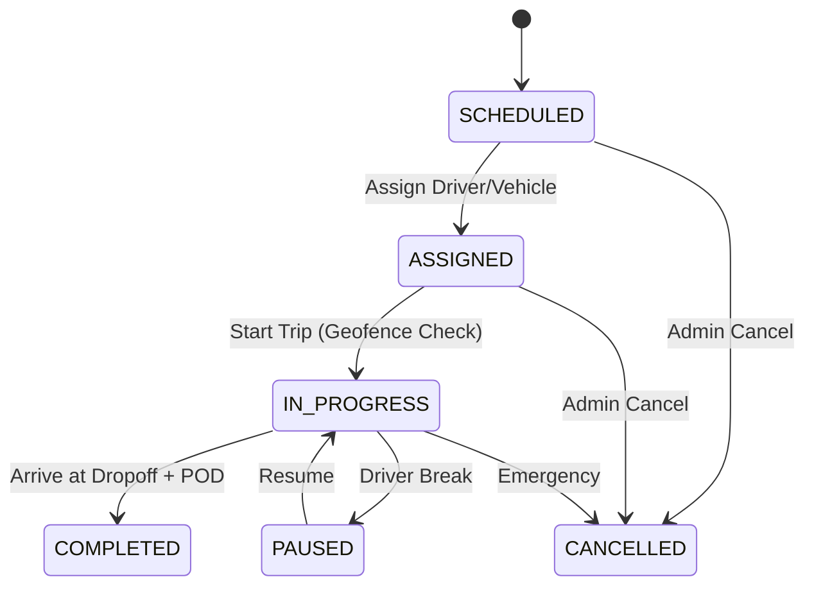

# Phase 1: Foundation & Recovery - Technical Design

**Status**: Draft
**Focus**: Week 1 (Core Services & Security)
**Based on**: Deep System Audit (Hollow Core Findings)

---

## 1. Problem Statement: "The Hollow Core"
The Deep System Audit revealed a critical discrepancy:
*   **Advanced Features**: `FuelService`, `SafetyService` are partially implemented with logic.
*   **Core Features**: `TripService` and `VehicleService` are **empty shells** (returning `nil`).
*   **Security**: Passwords are stored in plain text; Secrets are hardcoded.

We cannot build the "Samsara-class" features on this broken foundation.

---

## 2. Execution Plan

### Step 1: Security Hardening (Priority: Critical)
**Target**: `internal/handlers/organization_handler.go`
*   **Current State**: `// TODO: Add bcrypt hashing`
*   **Implementation**:
    1.  Import `golang.org/x/crypto/bcrypt`.
    2.  In `RegisterOrganization`, hash `req.AdminPassword` before saving.
    3.  Verify `Login` handler compares hash correctly.
    4.  **Secrets**: Refactor `config.go` to prefer Secret Manager (or at least strict Env Vars) over defaults.

### Step 2: Vehicle Service Implementation
**Target**: `internal/services/vehicle.go`
*   **Current State**: Empty methods returning `nil`.
*   **Implementation**:
    *   `CreateVehicle`: Validate VIN/Plate uniqueness -> `db.Create()`.
    *   `GetVehicles`: Implement Pagination + Filtering (by Status, Type).
    *   `UpdateVehicle`: Handle concurrency (optimistic locking if needed).
    *   `GetVehicleLocation`: Join with `LocationPings` table.

### Step 3: Trip Service Implementation
**Target**: `internal/services/trip.go`
*   **Current State**: Empty methods returning `nil`.
*   **Implementation**:
    *   **State Machine**: Enforce transitions (`SCHEDULED` -> `ASSIGNED` -> `IN_PROGRESS` -> `COMPLETED`).
    *   `CreateTrip`: Validate Route/Customer -> Generate `TrackingID`.
    *   `AssignTrip`: Check `Vehicle.IsAvailable()` -> Update Trip -> Notify Driver (MQTT).
    *   `StartTrip`: Validate Geofence (is at pickup?) -> Update Status.
    *   `CompleteTrip`: Validate Geofence (is at dropoff?) -> Calculate Cost -> Update Status.

### Step 4: Wiring & Verification
*   **Target**: `internal/routes/routes.go`
*   **Action**: Ensure all new Service methods are correctly called by Handlers.
*   **Verification**: Run `comprehensive_coverage_test.go` to ensure pass.

---

## 3. Technical Specifications

### 3.1 Password Hashing
```go
func HashPassword(password string) (string, error) {
    bytes, err := bcrypt.GenerateFromPassword([]byte(password), 14)
    return string(bytes), err
}

func CheckPasswordHash(password, hash string) bool {
    err := bcrypt.CompareHashAndPassword([]byte(hash), []byte(password))
    return err == nil
}
```

### 3.2 Trip State Machine
| From State | To State | Trigger | Condition |
|------------|----------|---------|-----------|
| `SCHEDULED` | `ASSIGNED` | `AssignTrip` | Driver & Vehicle Available |
| `ASSIGNED` | `IN_PROGRESS` | `StartTrip` | Driver at Pickup Location |
| `IN_PROGRESS` | `PAUSED` | `PauseTrip` | Driver Request |
| `PAUSED` | `IN_PROGRESS` | `ResumeTrip` | Driver Request |
| `IN_PROGRESS` | `COMPLETED` | `CompleteTrip` | Driver at Dropoff + POD |
| `*` | `CANCELLED` | `CancelTrip` | Admin Action |

---

## 4. Immediate Next Action
**Start Step 1**: Fix `OrganizationHandler` password storage.

---

## 5. Deep Dive: Core Logic Implementation

### 5.1 The Trip State Machine (The "Brain")
The `TripService` isn't just CRUD; it's a strict State Machine. We must prevent invalid transitions to ensure data integrity.



**Critical Validation Rules**:
1.  **Start Trip**: Can ONLY happen if `Status == ASSIGNED` AND `DriverID` is set AND `VehicleID` is set.
2.  **Complete Trip**: Can ONLY happen if `Status == IN_PROGRESS`.
3.  **Assign Trip**: Can ONLY happen if `Status == SCHEDULED` OR `Status == ASSIGNED` (re-assignment).

### 5.2 Vehicle Concurrency (The "Double-Booking" Problem)
**Scenario**: Two dispatchers try to assign the same Truck (TN-01-AB-1234) to two different trips at the same time.
**Solution**: Optimistic Locking or Transactional Checks.

**Implementation Logic**:
```go
tx.Transaction(func(tx *gorm.DB) error {
    // 1. Lock the vehicle row
    var vehicle Vehicle
    if err := tx.Clauses(clause.Locking{Strength: "UPDATE"}).First(&vehicle, vehicleID).Error; err != nil {
        return err
    }

    // 2. Check availability
    if !vehicle.IsAvailable() {
        return fmt.Errorf("vehicle %s is already assigned or in maintenance", vehicle.LicensePlate)
    }

    // 3. Assign to trip
    // ...
})
```

### 5.3 Security Implementation Details
*   **Bcrypt Cost**: Use `bcrypt.DefaultCost` (10) or higher (12) for admin passwords.
*   **Timing Attack Protection**: Use `subtle.ConstantTimeCompare` (though bcrypt handles this internally).
*   **Salt**: Bcrypt handles salting automatically; we just need to store the full hash string.

### 5.4 Critical Missing Logic (Addressed)
*   **Driver Availability**: Similar to vehicles, Drivers cannot be assigned to two active trips.
    *   *Fix*: `Driver.IsAvailable()` check inside the assignment transaction.
*   **Audit Integration**: The `AuditService` exists but is unused.
    *   *Requirement*: Every state change (Trip Start, Vehicle Update) MUST call `auditService.LogAction()`.
*   **Ingestion Idempotency**: Devices often retry sending data.
    *   *Fix*: Use Redis to store `event_id` with a 24h TTL. If exists, ignore duplicate.


