# 🔐 **Phase 1: Security Framework Implementation Guide**

## 📊 **OVERVIEW**
**Timeline:** 2-3 days  
**Priority:** 🔴 CRITICAL  
**Dependencies:** Backend API services, Database setup  
**Goal:** Implement enterprise-grade security for fleet management system

---

## 🎯 **SECURITY ARCHITECTURE**

```mermaid
graph TB
    subgraph "Authentication Layer"
        JWT[JWT Tokens]
        MFA[Multi-Factor Auth]
        OTP[OTP Service]
        RBAC[Role-Based Access]
    end
    
    subgraph "API Security"
        RL[Rate Limiting]
        VS[Input Validation]
        CORS[CORS Policies]
        HTTPS[SSL/TLS]
    end
    
    subgraph "Data Protection"
        ENC[Data Encryption]
        HASH[Password Hashing]
        AUDIT[Audit Logging]
        MASK[Data Masking]
    end
    
    JWT --> MFA
    MFA --> OTP
    OTP --> RBAC
    
    RL --> VS
    VS --> CORS
    CORS --> HTTPS
    
    ENC --> HASH
    HASH --> AUDIT
    AUDIT --> MASK
```



---

## 🔑 **STEP 1: MULTI-FACTOR AUTHENTICATION (MFA)**

### **1.1 Install Required Dependencies**

```bash
# Add to go.mod
go get github.com/pquerna/otp
go get github.com/skip2/go-qrcode
go get github.com/golang-jwt/jwt/v4
go get golang.org/x/crypto/bcrypt
```

### **1.2 Database Schema Updates**

```sql
-- Migration: add_mfa_support.sql
ALTER TABLE user_accounts ADD COLUMN mfa_enabled BOOLEAN DEFAULT FALSE;
ALTER TABLE user_accounts ADD COLUMN mfa_secret TEXT;
ALTER TABLE user_accounts ADD COLUMN backup_codes JSONB;
ALTER TABLE user_accounts ADD COLUMN last_mfa_at TIMESTAMP WITH TIME ZONE;

CREATE TABLE mfa_challenges (
    id UUID PRIMARY KEY DEFAULT gen_random_uuid(),
    user_id BIGINT REFERENCES user_accounts(id),
    method VARCHAR(20) NOT NULL, -- 'SMS', 'EMAIL', 'TOTP', 'PUSH'
    code_hash TEXT NOT NULL,
    expires_at TIMESTAMP WITH TIME ZONE NOT NULL,
    attempts INTEGER DEFAULT 0,
    max_attempts INTEGER DEFAULT 3,
    verified BOOLEAN DEFAULT FALSE,
    ip_address INET,
    user_agent TEXT,
    created_at TIMESTAMP WITH TIME ZONE DEFAULT NOW()
);

CREATE INDEX idx_mfa_challenges_user_id ON mfa_challenges(user_id);
CREATE INDEX idx_mfa_challenges_expires_at ON mfa_challenges(expires_at);
```

### **1.3 MFA Service Implementation**

```go
// pkg/auth/mfa_service.go
package auth

import (
    "context"
    "crypto/rand"
    "crypto/sha256"
    "encoding/base32"
    "encoding/hex"
    "fmt"
    "time"
    
    "github.com/pquerna/otp"
    "github.com/pquerna/otp/totp"
    "github.com/skip2/go-qrcode"
    "gorm.io/gorm"
)

type MFAService struct {
    db          *gorm.DB
    smsService  SMSService
    emailService EmailService
    issuer      string // "FleetFlow India"
}

type MFAMethod string

const (
    MFAMethodSMS   MFAMethod = "SMS"
    MFAMethodEmail MFAMethod = "EMAIL"
    MFAMethodTOTP  MFAMethod = "TOTP"
)

type MFAChallenge struct {
    ID          string     `json:"id" gorm:"type:uuid;primary_key;default:gen_random_uuid()"`
    UserID      uint64     `json:"user_id"`
    Method      MFAMethod  `json:"method"`
    CodeHash    string     `json:"-" gorm:"column:code_hash"`
    ExpiresAt   time.Time  `json:"expires_at"`
    Attempts    int        `json:"attempts"`
    MaxAttempts int        `json:"max_attempts"`
    Verified    bool       `json:"verified"`
    IPAddress   string     `json:"ip_address"`
    UserAgent   string     `json:"user_agent"`
    CreatedAt   time.Time  `json:"created_at"`
}

func NewMFAService(db *gorm.DB, sms SMSService, email EmailService) *MFAService {
    return &MFAService{
        db:           db,
        smsService:   sms,
        emailService: email,
        issuer:       "FleetFlow India",
    }
}

// Setup TOTP for user
func (mfa *MFAService) SetupTOTP(ctx context.Context, userID uint64, userEmail string) (*TOTPSetup, error) {
    // Generate TOTP secret
    key, err := totp.Generate(totp.GenerateOpts{
        Issuer:      mfa.issuer,
        AccountName: userEmail,
        SecretSize:  32,
    })
    if err != nil {
        return nil, fmt.Errorf("failed to generate TOTP key: %w", err)
    }
    
    // Generate QR code
    qrCode, err := qrcode.Encode(key.URL(), qrcode.Medium, 256)
    if err != nil {
        return nil, fmt.Errorf("failed to generate QR code: %w", err)
    }
    
    // Generate backup codes
    backupCodes, err := mfa.generateBackupCodes()
    if err != nil {
        return nil, fmt.Errorf("failed to generate backup codes: %w", err)
    }
    
    return &TOTPSetup{
        Secret:      key.Secret(),
        QRCode:      qrCode,
        BackupCodes: backupCodes,
        ManualEntry: key.URL(),
    }, nil
}

// Enable MFA for user
func (mfa *MFAService) EnableMFA(ctx context.Context, userID uint64, secret string, verificationCode string) error {
    // Verify the TOTP code
    valid := totp.Validate(verificationCode, secret, time.Now())
    if !valid {
        return fmt.Errorf("invalid verification code")
    }
    
    // Update user record
    result := mfa.db.Model(&UserAccount{}).
        Where("id = ?", userID).
        Updates(map[string]interface{}{
            "mfa_enabled": true,
            "mfa_secret":  secret,
            "updated_at":  time.Now(),
        })
    
    if result.Error != nil {
        return fmt.Errorf("failed to enable MFA: %w", result.Error)
    }
    
    return nil
}

// Initiate MFA challenge
func (mfa *MFAService) InitiateMFA(ctx context.Context, userID uint64, method MFAMethod, clientInfo ClientInfo) (*MFAChallenge, error) {
    challenge := &MFAChallenge{
        UserID:      userID,
        Method:      method,
        ExpiresAt:   time.Now().Add(5 * time.Minute),
        MaxAttempts: 3,
        IPAddress:   clientInfo.IPAddress,
        UserAgent:   clientInfo.UserAgent,
    }
    
    switch method {
    case MFAMethodSMS:
        return mfa.initiateSMSChallenge(ctx, challenge)
    case MFAMethodEmail:
        return mfa.initiateEmailChallenge(ctx, challenge)
    case MFAMethodTOTP:
        return mfa.initiateTOTPChallenge(ctx, challenge)
    default:
        return nil, fmt.Errorf("unsupported MFA method: %s", method)
    }
}

func (mfa *MFAService) initiateSMSChallenge(ctx context.Context, challenge *MFAChallenge) (*MFAChallenge, error) {
    // Generate 6-digit code
    code := mfa.generateNumericCode(6)
    challenge.CodeHash = mfa.hashCode(code)
    
    // Get user's phone number
    var user UserAccount
    if err := mfa.db.First(&user, challenge.UserID).Error; err != nil {
        return nil, fmt.Errorf("user not found: %w", err)
    }
    
    // Send SMS
    message := fmt.Sprintf("FleetFlow Security Code: %s. Valid for 5 minutes. Don't share this code.", code)
    if err := mfa.smsService.SendSMS(ctx, user.PhoneNumber, message); err != nil {
        return nil, fmt.Errorf("failed to send SMS: %w", err)
    }
    
    // Store challenge
    if err := mfa.db.Create(challenge).Error; err != nil {
        return nil, fmt.Errorf("failed to store MFA challenge: %w", err)
    }
    
    return challenge, nil
}

// Verify MFA challenge
func (mfa *MFAService) VerifyMFA(ctx context.Context, challengeID, code string, clientInfo ClientInfo) (*MFAVerification, error) {
    var challenge MFAChallenge
    if err := mfa.db.First(&challenge, "id = ?", challengeID).Error; err != nil {
        return nil, fmt.Errorf("challenge not found: %w", err)
    }
    
    // Check expiry
    if time.Now().After(challenge.ExpiresAt) {
        return nil, fmt.Errorf("MFA challenge expired")
    }
    
    // Check attempt limit
    if challenge.Attempts >= challenge.MaxAttempts {
        return nil, fmt.Errorf("maximum attempts exceeded")
    }
    
    // Increment attempts
    challenge.Attempts++
    mfa.db.Save(&challenge)
    
    // Verify code based on method
    var valid bool
    switch challenge.Method {
    case MFAMethodSMS, MFAMethodEmail:
        valid = mfa.verifyHashedCode(code, challenge.CodeHash)
    case MFAMethodTOTP:
        valid = mfa.verifyTOTPCode(ctx, challenge.UserID, code)
    }
    
    if !valid {
        return &MFAVerification{
            Success:           false,
            RemainingAttempts: challenge.MaxAttempts - challenge.Attempts,
        }, nil
    }
    
    // Mark as verified
    challenge.Verified = true
    mfa.db.Save(&challenge)
    
    // Update user's last MFA timestamp
    mfa.db.Model(&UserAccount{}).
        Where("id = ?", challenge.UserID).
        Update("last_mfa_at", time.Now())
    
    return &MFAVerification{
        Success:    true,
        UserID:     challenge.UserID,
        VerifiedAt: time.Now(),
        Method:     challenge.Method,
        ValidUntil: time.Now().Add(24 * time.Hour), // MFA valid for 24 hours
    }, nil
}

func (mfa *MFAService) generateNumericCode(length int) string {
    const digits = "0123456789"
    bytes := make([]byte, length)
    rand.Read(bytes)
    
    for i, b := range bytes {
        bytes[i] = digits[b%byte(len(digits))]
    }
    
    return string(bytes)
}

func (mfa *MFAService) hashCode(code string) string {
    hash := sha256.Sum256([]byte(code))
    return hex.EncodeToString(hash[:])
}

func (mfa *MFAService) verifyHashedCode(code, hash string) bool {
    return mfa.hashCode(code) == hash
}

func (mfa *MFAService) generateBackupCodes() ([]string, error) {
    codes := make([]string, 10)
    for i := range codes {
        codes[i] = mfa.generateNumericCode(8)
    }
    return codes, nil
}

type TOTPSetup struct {
    Secret      string   `json:"-"`           // Don't expose in API
    QRCode      []byte   `json:"qr_code"`     // Base64 encoded QR code image
    BackupCodes []string `json:"backup_codes"`
    ManualEntry string   `json:"manual_entry"` // For manual setup in authenticator
}

type MFAVerification struct {
    Success           bool         `json:"success"`
    UserID            uint64       `json:"user_id,omitempty"`
    VerifiedAt        time.Time    `json:"verified_at,omitempty"`
    Method            MFAMethod    `json:"method,omitempty"`
    ValidUntil        time.Time    `json:"valid_until,omitempty"`
    RemainingAttempts int          `json:"remaining_attempts,omitempty"`
}

type ClientInfo struct {
    IPAddress string
    UserAgent string
}
```

---

## 🛡️ **STEP 2: ROLE-BASED ACCESS CONTROL (RBAC)**

### **2.1 Permission Matrix Definition**

```go
// pkg/auth/rbac.go
package auth

type Role string
type Permission string
type Resource string
type Action string

const (
    // Roles in hierarchy (higher roles inherit lower role permissions)
    RoleSuperAdmin    Role = "super_admin"
    RoleFleetManager  Role = "fleet_manager"
    RoleDispatcher    Role = "dispatcher"
    RoleDriver        Role = "driver"
    RoleMechanic      Role = "mechanic"
    RoleCustomer      Role = "customer"
    RoleViewer        Role = "viewer"
    
    // Resources
    ResourceVehicle     Resource = "vehicle"
    ResourceDriver      Resource = "driver"
    ResourceTrip        Resource = "trip"
    ResourceFuel        Resource = "fuel"
    ResourceMaintenance Resource = "maintenance"
    ResourceReport      Resource = "report"
    ResourcePayment     Resource = "payment"
    ResourceSystem      Resource = "system"
    ResourceUser        Resource = "user"
    
    // Actions
    ActionCreate Action = "create"
    ActionRead   Action = "read"
    ActionUpdate Action = "update"
    ActionDelete Action = "delete"
    ActionManage Action = "manage" // Full CRUD + special operations
    ActionAssign Action = "assign"
    ActionApprove Action = "approve"
)

type PermissionRule struct {
    Resource   Resource `json:"resource"`
    Action     Action   `json:"action"`
    Conditions []string `json:"conditions,omitempty"` // e.g., "own_vehicles_only"
}

type RBACService struct {
    permissions map[Role][]PermissionRule
    logger      *logger.Logger
}

func NewRBACService(logger *logger.Logger) *RBACService {
    rbac := &RBACService{
        permissions: make(map[Role][]PermissionRule),
        logger:      logger,
    }
    
    rbac.definePermissions()
    return rbac
}

func (r *RBACService) definePermissions() {
    // Super Admin - Full system access
    r.permissions[RoleSuperAdmin] = []PermissionRule{
        {Resource: "*", Action: "*"},
    }
    
    // Fleet Manager - Manage entire fleet operations
    r.permissions[RoleFleetManager] = []PermissionRule{
        {Resource: ResourceVehicle, Action: ActionManage},
        {Resource: ResourceDriver, Action: ActionManage},
        {Resource: ResourceTrip, Action: ActionManage},
        {Resource: ResourceFuel, Action: ActionRead},
        {Resource: ResourceMaintenance, Action: ActionManage},
        {Resource: ResourceReport, Action: ActionRead},
        {Resource: ResourcePayment, Action: ActionRead},
        {Resource: ResourceUser, Action: ActionRead, Conditions: []string{"fleet_users_only"}},
    }
    
    // Dispatcher - Trip and route management
    r.permissions[RoleDispatcher] = []PermissionRule{
        {Resource: ResourceVehicle, Action: ActionRead},
        {Resource: ResourceDriver, Action: ActionRead},
        {Resource: ResourceTrip, Action: ActionManage},
        {Resource: ResourceTrip, Action: ActionAssign},
        {Resource: ResourceReport, Action: ActionRead, Conditions: []string{"trip_reports_only"}},
    }
    
    // Driver - Limited access to own data and assigned vehicles
    r.permissions[RoleDriver] = []PermissionRule{
        {Resource: ResourceVehicle, Action: ActionRead, Conditions: []string{"assigned_vehicles_only"}},
        {Resource: ResourceTrip, Action: ActionRead, Conditions: []string{"own_trips_only"}},
        {Resource: ResourceTrip, Action: ActionUpdate, Conditions: []string{"own_active_trips_only"}},
        {Resource: ResourceFuel, Action: ActionCreate, Conditions: []string{"assigned_vehicles_only"}},
        {Resource: ResourceMaintenance, Action: ActionCreate, Conditions: []string{"assigned_vehicles_only"}},
        {Resource: ResourceUser, Action: ActionRead, Conditions: []string{"own_profile_only"}},
        {Resource: ResourceUser, Action: ActionUpdate, Conditions: []string{"own_profile_only"}},
    }
    
    // Mechanic - Vehicle maintenance access
    r.permissions[RoleMechanic] = []PermissionRule{
        {Resource: ResourceVehicle, Action: ActionRead},
        {Resource: ResourceMaintenance, Action: ActionManage},
        {Resource: ResourceReport, Action: ActionRead, Conditions: []string{"maintenance_reports_only"}},
    }
    
    // Customer - Track their shipments
    r.permissions[RoleCustomer] = []PermissionRule{
        {Resource: ResourceTrip, Action: ActionRead, Conditions: []string{"own_shipments_only"}},
    }
    
    // Viewer - Read-only access to basic fleet data
    r.permissions[RoleViewer] = []PermissionRule{
        {Resource: ResourceVehicle, Action: ActionRead},
        {Resource: ResourceDriver, Action: ActionRead},
        {Resource: ResourceTrip, Action: ActionRead},
        {Resource: ResourceReport, Action: ActionRead},
    }
}

// Authorization context for permission checking
type AuthorizationContext struct {
    UserID    uint64
    Role      Role
    FleetID   uint64 // For multi-tenant support
    VehicleID uint64 // For vehicle-specific permissions
    TripID    uint64 // For trip-specific permissions
    DriverID  uint64 // For driver-specific permissions
}

// Check if user has permission for resource and action
func (r *RBACService) CheckPermission(ctx context.Context, authCtx AuthorizationContext, resource Resource, action Action) error {
    permissions, exists := r.permissions[authCtx.Role]
    if !exists {
        return fmt.Errorf("unknown role: %s", authCtx.Role)
    }
    
    // Check for wildcard permissions (super admin)
    for _, perm := range permissions {
        if perm.Resource == "*" && perm.Action == "*" {
            r.logAuthEvent(ctx, "PERMISSION_GRANTED", authCtx, resource, action, "wildcard")
            return nil
        }
    }
    
    // Check specific permissions
    for _, perm := range permissions {
        if r.matchesPermission(perm, resource, action) {
            if r.checkConditions(ctx, perm, authCtx) {
                r.logAuthEvent(ctx, "PERMISSION_GRANTED", authCtx, resource, action, "conditional")
                return nil
            }
        }
    }
    
    // Permission denied
    r.logAuthEvent(ctx, "PERMISSION_DENIED", authCtx, resource, action, "no_match")
    return &errors.FleetFlowError{
        Code:    errors.ErrorInsufficientPermissions,
        Message: fmt.Sprintf("Permission denied: %s:%s for role %s", resource, action, authCtx.Role),
        Context: map[string]interface{}{
            "user_id":  authCtx.UserID,
            "role":     authCtx.Role,
            "resource": resource,
            "action":   action,
        },
    }
}

func (r *RBACService) matchesPermission(perm PermissionRule, resource Resource, action Action) bool {
    resourceMatch := perm.Resource == resource || perm.Resource == "*"
    actionMatch := perm.Action == action || perm.Action == "*" || perm.Action == ActionManage
    
    return resourceMatch && actionMatch
}

func (r *RBACService) checkConditions(ctx context.Context, perm PermissionRule, authCtx AuthorizationContext) bool {
    for _, condition := range perm.Conditions {
        switch condition {
        case "own_vehicles_only":
            if !r.isUserVehicleOwner(ctx, authCtx.UserID, authCtx.VehicleID) {
                return false
            }
        case "assigned_vehicles_only":
            if !r.isDriverAssignedToVehicle(ctx, authCtx.UserID, authCtx.VehicleID) {
                return false
            }
        case "own_trips_only":
            if !r.isUserTripOwner(ctx, authCtx.UserID, authCtx.TripID) {
                return false
            }
        case "own_active_trips_only":
            if !r.isUserActiveTrip(ctx, authCtx.UserID, authCtx.TripID) {
                return false
            }
        case "fleet_users_only":
            if !r.isFleetUser(ctx, authCtx.FleetID, authCtx.UserID) {
                return false
            }
        case "own_profile_only":
            if authCtx.UserID != authCtx.DriverID {
                return false
            }
        // Add more conditions as needed
        default:
            r.logger.WithField("condition", condition).Warn("Unknown permission condition")
            return false
        }
    }
    return true
}

// Helper functions for condition checking
func (r *RBACService) isUserVehicleOwner(ctx context.Context, userID, vehicleID uint64) bool {
    // Implementation to check if user owns the vehicle
    var count int64
    r.db.Model(&Vehicle{}).
        Where("id = ? AND fleet_owner_id = ?", vehicleID, userID).
        Count(&count)
    return count > 0
}

func (r *RBACService) isDriverAssignedToVehicle(ctx context.Context, driverID, vehicleID uint64) bool {
    var count int64
    r.db.Model(&Vehicle{}).
        Where("id = ? AND assigned_driver_id = ?", vehicleID, driverID).
        Count(&count)
    return count > 0
}
```

### **2.2 RBAC Middleware Implementation**

```go
// pkg/middleware/rbac_middleware.go
package middleware

import (
    "context"
    "net/http"
    "strconv"
    
    "github.com/gorilla/mux"
    "fleetflow/pkg/auth"
    "fleetflow/pkg/errors"
)

type RBACMiddleware struct {
    rbacService *auth.RBACService
}

func NewRBACMiddleware(rbacService *auth.RBACService) *RBACMiddleware {
    return &RBACMiddleware{
        rbacService: rbacService,
    }
}

// Create middleware for specific resource and action
func (rm *RBACMiddleware) RequirePermission(resource auth.Resource, action auth.Action) func(http.Handler) http.Handler {
    return func(next http.Handler) http.Handler {
        return http.HandlerFunc(func(w http.ResponseWriter, r *http.Request) {
            // Extract auth context from request (set by JWT middleware)
            authCtx, ok := r.Context().Value("auth_context").(auth.AuthorizationContext)
            if !ok {
                errors.WriteErrorResponse(w, r, &errors.FleetFlowError{
                    Code:    errors.ErrorTokenInvalid,
                    Message: "Authentication required",
                })
                return
            }
            
            // Extract resource IDs from URL parameters for conditional permissions
            vars := mux.Vars(r)
            if vehicleID := vars["vehicleId"]; vehicleID != "" {
                if id, err := strconv.ParseUint(vehicleID, 10, 64); err == nil {
                    authCtx.VehicleID = id
                }
            }
            if tripID := vars["tripId"]; tripID != "" {
                if id, err := strconv.ParseUint(tripID, 10, 64); err == nil {
                    authCtx.TripID = id
                }
            }
            if driverID := vars["driverId"]; driverID != "" {
                if id, err := strconv.ParseUint(driverID, 10, 64); err == nil {
                    authCtx.DriverID = id
                }
            }
            
            // Check permission
            if err := rm.rbacService.CheckPermission(r.Context(), authCtx, resource, action); err != nil {
                if fleetErr, ok := err.(*errors.FleetFlowError); ok {
                    errors.WriteErrorResponse(w, r, fleetErr)
                } else {
                    errors.WriteErrorResponse(w, r, &errors.FleetFlowError{
                        Code:    errors.ErrorInsufficientPermissions,
                        Message: "Access denied",
                    })
                }
                return
            }
            
            // Add updated auth context to request
            ctx := context.WithValue(r.Context(), "auth_context", authCtx)
            next.ServeHTTP(w, r.WithContext(ctx))
        })
    }
}

// Usage in route handlers
func SetupRoutes(rbacMiddleware *RBACMiddleware) *mux.Router {
    router := mux.NewRouter()
    
    // Vehicle management routes
    router.Handle("/api/vehicles", 
        rbacMiddleware.RequirePermission(auth.ResourceVehicle, auth.ActionRead)(
            http.HandlerFunc(getVehiclesHandler))).
        Methods("GET")
        
    router.Handle("/api/vehicles", 
        rbacMiddleware.RequirePermission(auth.ResourceVehicle, auth.ActionCreate)(
            http.HandlerFunc(createVehicleHandler))).
        Methods("POST")
        
    router.Handle("/api/vehicles/{vehicleId}", 
        rbacMiddleware.RequirePermission(auth.ResourceVehicle, auth.ActionUpdate)(
            http.HandlerFunc(updateVehicleHandler))).
        Methods("PUT")
        
    // Trip management routes
    router.Handle("/api/trips/{tripId}/complete", 
        rbacMiddleware.RequirePermission(auth.ResourceTrip, auth.ActionUpdate)(
            http.HandlerFunc(completeTripHandler))).
        Methods("POST")
        
    // Driver-specific routes with conditional permissions
    router.Handle("/api/drivers/{driverId}/profile", 
        rbacMiddleware.RequirePermission(auth.ResourceUser, auth.ActionUpdate)(
            http.HandlerFunc(updateDriverProfileHandler))).
        Methods("PUT")
    
    return router
}
```

---

## 🔒 **STEP 3: API SECURITY HARDENING**

### **3.1 Rate Limiting Implementation**

```go
// pkg/middleware/rate_limiter.go
package middleware

import (
    "context"
    "fmt"
    "net/http"
    "sync"
    "time"
    
    "golang.org/x/time/rate"
    "fleetflow/pkg/errors"
)

type RateLimiter struct {
    limiters map[string]*rate.Limiter
    rules    map[string]RateRule
    mu       sync.RWMutex
}

type RateRule struct {
    RequestsPerMinute int
    BurstSize         int
    KeyExtractor      func(*http.Request) string
}

func NewRateLimiter() *RateLimiter {
    rl := &RateLimiter{
        limiters: make(map[string]*rate.Limiter),
        rules:    make(map[string]RateRule),
    }
    
    // Define rate limiting rules
    rl.defineRules()
    
    return rl
}

func (rl *RateLimiter) defineRules() {
    // Authentication endpoints - strict limits
    rl.rules["auth"] = RateRule{
        RequestsPerMinute: 10,
        BurstSize:         3,
        KeyExtractor: func(r *http.Request) string {
            return getClientIP(r)
        },
    }
    
    // Location updates - high throughput but per-vehicle limits
    rl.rules["location"] = RateRule{
        RequestsPerMinute: 120, // 2 updates per second per vehicle
        BurstSize:         10,
        KeyExtractor: func(r *http.Request) string {
            vehicleID := r.Header.Get("X-Vehicle-ID")
            if vehicleID == "" {
                return getClientIP(r)
            }
            return fmt.Sprintf("vehicle:%s", vehicleID)
        },
    }
    
    // General API - per user limits
    rl.rules["api"] = RateRule{
        RequestsPerMinute: 1000,
        BurstSize:         50,
        KeyExtractor: func(r *http.Request) string {
            userID := getUserIDFromContext(r.Context())
            if userID == 0 {
                return getClientIP(r)
            }
            return fmt.Sprintf("user:%d", userID)
        },
    }
}

func (rl *RateLimiter) RateLimit(ruleName string) func(http.Handler) http.Handler {
    return func(next http.Handler) http.Handler {
        return http.HandlerFunc(func(w http.ResponseWriter, r *http.Request) {
            rule, exists := rl.rules[ruleName]
            if !exists {
                next.ServeHTTP(w, r) // No rate limiting rule
                return
            }
            
            key := rule.KeyExtractor(r)
            limiter := rl.getLimiter(key, rule)
            
            if !limiter.Allow() {
                errors.WriteErrorResponse(w, r, &errors.FleetFlowError{
                    Code:       errors.ErrorRateLimitExceeded,
                    Message:    "Rate limit exceeded",
                    HTTPStatus: 429,
                })
                return
            }
            
            next.ServeHTTP(w, r)
        })
    }
}

func (rl *RateLimiter) getLimiter(key string, rule RateRule) *rate.Limiter {
    rl.mu.Lock()
    defer rl.mu.Unlock()
    
    limiter, exists := rl.limiters[key]
    if !exists {
        limiter = rate.NewLimiter(
            rate.Limit(rule.RequestsPerMinute)/60, // Convert to per-second rate
            rule.BurstSize,
        )
        rl.limiters[key] = limiter
    }
    
    return limiter
}
```

### **3.2 Input Validation Middleware**

```go
// pkg/middleware/validation.go
package middleware

import (
    "encoding/json"
    "net/http"
    "regexp"
    "strings"
    
    "github.com/go-playground/validator/v10"
    "fleetflow/pkg/errors"
)

type ValidationMiddleware struct {
    validator *validator.Validate
}

func NewValidationMiddleware() *ValidationMiddleware {
    v := validator.New()
    
    // Register custom validators for fleet-specific data
    v.RegisterValidation("vehicle_registration", validateVehicleRegistration)
    v.RegisterValidation("indian_mobile", validateIndianMobile)
    v.RegisterValidation("coordinates", validateCoordinates)
    v.RegisterValidation("vin_number", validateVIN)
    
    return &ValidationMiddleware{validator: v}
}

// Sanitize input to prevent XSS and injection attacks
func SanitizeInput(input string) string {
    // Remove potentially dangerous characters
    input = strings.ReplaceAll(input, "<", "&lt;")
    input = strings.ReplaceAll(input, ">", "&gt;")
    input = strings.ReplaceAll(input, "\"", "&quot;")
    input = strings.ReplaceAll(input, "'", "&#x27;")
    input = strings.ReplaceAll(input, "&", "&amp;")
    
    // Remove SQL injection patterns
    sqlPatterns := []string{
        `(?i)(union\s+select)`,
        `(?i)(drop\s+table)`,
        `(?i)(delete\s+from)`,
        `(?i)(insert\s+into)`,
        `(?i)(update\s+set)`,
        `(?i)(exec\s*\()`,
        `(?i)(script\s*:)`,
        `(?i)(javascript\s*:)`,
    }
    
    for _, pattern := range sqlPatterns {
        re := regexp.MustCompile(pattern)
        input = re.ReplaceAllString(input, "")
    }
    
    return strings.TrimSpace(input)
}

// Validate JSON request body
func (vm *ValidationMiddleware) ValidateJSON(v interface{}) func(http.Handler) http.Handler {
    return func(next http.Handler) http.Handler {
        return http.HandlerFunc(func(w http.ResponseWriter, r *http.Request) {
            if err := json.NewDecoder(r.Body).Decode(v); err != nil {
                errors.WriteErrorResponse(w, r, &errors.FleetFlowError{
                    Code:    errors.ErrorInvalidRequestFormat,
                    Message: "Invalid JSON format",
                })
                return
            }
            
            if err := vm.validator.Struct(v); err != nil {
                validationErrors := vm.extractValidationErrors(err)
                errors.WriteValidationError(w, r, validationErrors)
                return
            }
            
            next.ServeHTTP(w, r)
        })
    }
}

func (vm *ValidationMiddleware) extractValidationErrors(err error) []errors.FieldError {
    var fieldErrors []errors.FieldError
    
    if validationErrors, ok := err.(validator.ValidationErrors); ok {
        for _, ve := range validationErrors {
            fieldErrors = append(fieldErrors, errors.FieldError{
                Field:   ve.Field(),
                Message: vm.getErrorMessage(ve),
                Code:    ve.Tag(),
            })
        }
    }
    
    return fieldErrors
}

// Custom validators for fleet-specific data
func validateVehicleRegistration(fl validator.FieldLevel) bool {
    registration := fl.Field().String()
    // Indian vehicle registration pattern: XX##XX####
    pattern := `^[A-Z]{2}[0-9]{2}[A-Z]{2}[0-9]{4}$`
    matched, _ := regexp.MatchString(pattern, registration)
    return matched
}

func validateIndianMobile(fl validator.FieldLevel) bool {
    mobile := fl.Field().String()
    // Indian mobile number pattern
    pattern := `^(\+91|91)?[6-9][0-9]{9}$`
    matched, _ := regexp.MatchString(pattern, mobile)
    return matched
}

func validateCoordinates(fl validator.FieldLevel) bool {
    coord := fl.Field().Float()
    // Basic coordinate validation
    return coord >= -180 && coord <= 180
}

func validateVIN(fl validator.FieldLevel) bool {
    vin := fl.Field().String()
    // Basic VIN validation (17 characters, alphanumeric, no I, O, Q)
    pattern := `^[A-HJ-NPR-Z0-9]{17}$`
    matched, _ := regexp.MatchString(pattern, vin)
    return matched
}
```

---

## 🔐 **STEP 4: DATA PROTECTION & ENCRYPTION**

### **4.1 Password Security**

```go
// pkg/auth/password_service.go
package auth

import (
    "crypto/rand"
    "fmt"
    
    "golang.org/x/crypto/bcrypt"
)

type PasswordService struct {
    cost int // bcrypt cost factor
}

func NewPasswordService() *PasswordService {
    return &PasswordService{
        cost: 14, // High cost for security (2^14 iterations)
    }
}

func (ps *PasswordService) HashPassword(password string) (string, error) {
    // Validate password strength
    if err := ps.validatePasswordStrength(password); err != nil {
        return "", err
    }
    
    hash, err := bcrypt.GenerateFromPassword([]byte(password), ps.cost)
    if err != nil {
        return "", fmt.Errorf("failed to hash password: %w", err)
    }
    
    return string(hash), nil
}

func (ps *PasswordService) VerifyPassword(password, hash string) error {
    return bcrypt.CompareHashAndPassword([]byte(hash), []byte(password))
}

func (ps *PasswordService) validatePasswordStrength(password string) error {
    if len(password) < 8 {
        return fmt.Errorf("password must be at least 8 characters long")
    }
    
    var hasUpper, hasLower, hasNumber, hasSpecial bool
    
    for _, char := range password {
        switch {
        case 'a' <= char && char <= 'z':
            hasLower = true
        case 'A' <= char && char <= 'Z':
            hasUpper = true
        case '0' <= char && char <= '9':
            hasNumber = true
        case char == '!' || char == '@' || char == '#' || char == '$' || 
             char == '%' || char == '^' || char == '&' || char == '*':
            hasSpecial = true
        }
    }
    
    if !hasUpper {
        return fmt.Errorf("password must contain at least one uppercase letter")
    }
    if !hasLower {
        return fmt.Errorf("password must contain at least one lowercase letter")
    }
    if !hasNumber {
        return fmt.Errorf("password must contain at least one number")
    }
    if !hasSpecial {
        return fmt.Errorf("password must contain at least one special character")
    }
    
    return nil
}

func (ps *PasswordService) GenerateSecurePassword(length int) (string, error) {
    const charset = "abcdefghijklmnopqrstuvwxyzABCDEFGHIJKLMNOPQRSTUVWXYZ0123456789!@#$%^&*"
    
    password := make([]byte, length)
    _, err := rand.Read(password)
    if err != nil {
        return "", err
    }
    
    for i, b := range password {
        password[i] = charset[b%byte(len(charset))]
    }
    
    return string(password), nil
}
```

### **4.2 Security Audit Logging**

```go
// pkg/auth/security_audit.go
package auth

import (
    "context"
    "encoding/json"
    "time"
    
    "fleetflow/pkg/logger"
)

type SecurityAuditLogger struct {
    logger *logger.Logger
}

type SecurityEvent struct {
    EventType   string                 `json:"event_type"`
    UserID      uint64                 `json:"user_id,omitempty"`
    IPAddress   string                 `json:"ip_address"`
    UserAgent   string                 `json:"user_agent"`
    Resource    string                 `json:"resource,omitempty"`
    Action      string                 `json:"action,omitempty"`
    Success     bool                   `json:"success"`
    Reason      string                 `json:"reason,omitempty"`
    Context     map[string]interface{} `json:"context,omitempty"`
    Timestamp   time.Time              `json:"timestamp"`
}

func NewSecurityAuditLogger(logger *logger.Logger) *SecurityAuditLogger {
    return &SecurityAuditLogger{logger: logger}
}

func (sal *SecurityAuditLogger) LogAuthEvent(ctx context.Context, eventType string, userID uint64, clientInfo ClientInfo, success bool, reason string) {
    event := SecurityEvent{
        EventType: eventType,
        UserID:    userID,
        IPAddress: clientInfo.IPAddress,
        UserAgent: clientInfo.UserAgent,
        Success:   success,
        Reason:    reason,
        Timestamp: time.Now(),
    }
    
    sal.logEvent(ctx, event)
}

func (sal *SecurityAuditLogger) LogPermissionEvent(ctx context.Context, authCtx AuthorizationContext, resource Resource, action Action, granted bool, reason string) {
    event := SecurityEvent{
        EventType: "PERMISSION_CHECK",
        UserID:    authCtx.UserID,
        Resource:  string(resource),
        Action:    string(action),
        Success:   granted,
        Reason:    reason,
        Context: map[string]interface{}{
            "role":       authCtx.Role,
            "vehicle_id": authCtx.VehicleID,
            "trip_id":    authCtx.TripID,
        },
        Timestamp: time.Now(),
    }
    
    sal.logEvent(ctx, event)
}

func (sal *SecurityAuditLogger) logEvent(ctx context.Context, event SecurityEvent) {
    eventJSON, _ := json.Marshal(event)
    
    logEntry := sal.logger.WithContext(ctx).
        WithFields(logger.Fields{
            "event_type": event.EventType,
            "user_id":    event.UserID,
            "ip_address": event.IPAddress,
            "success":    event.Success,
            "timestamp":  event.Timestamp,
        })
    
    if event.Success {
        logEntry.Info("Security event: " + string(eventJSON))
    } else {
        logEntry.Warn("Security event: " + string(eventJSON))
    }
    
    // Store in security audit table for compliance
    go sal.storeAuditRecord(event)
}

func (sal *SecurityAuditLogger) storeAuditRecord(event SecurityEvent) {
    // Store in dedicated audit table for compliance and investigation
    auditRecord := SecurityAuditRecord{
        EventType: event.EventType,
        UserID:    event.UserID,
        IPAddress: event.IPAddress,
        UserAgent: event.UserAgent,
        Resource:  event.Resource,
        Action:    event.Action,
        Success:   event.Success,
        Reason:    event.Reason,
        Context:   event.Context,
        CreatedAt: event.Timestamp,
    }
    
    // Insert into audit table
    db.Create(&auditRecord)
}

type SecurityAuditRecord struct {
    ID        uint64                 `gorm:"primarykey"`
    EventType string                 `gorm:"not null;index"`
    UserID    uint64                 `gorm:"index"`
    IPAddress string                 `gorm:"not null;index"`
    UserAgent string                 
    Resource  string                 `gorm:"index"`
    Action    string                 `gorm:"index"`
    Success   bool                   `gorm:"not null;index"`
    Reason    string                 
    Context   map[string]interface{} `gorm:"type:jsonb"`
    CreatedAt time.Time              `gorm:"not null;index"`
}
```

---

## 🧪 **STEP 5: SECURITY TESTING**

### **5.1 Security Test Suite**

```go
// tests/security_test.go
package tests

import (
    "testing"
    "net/http"
    "net/http/httptest"
    "strings"
    
    "fleetflow/pkg/auth"
)

func TestMFAFlow(t *testing.T) {
    // Test MFA setup and verification flow
    mfaService := setupMFAService()
    
    // Test TOTP setup
    setup, err := mfaService.SetupTOTP(context.Background(), 1, "test@fleetflow.in")
    if err != nil {
        t.Fatalf("Failed to setup TOTP: %v", err)
    }
    
    if len(setup.BackupCodes) != 10 {
        t.Errorf("Expected 10 backup codes, got %d", len(setup.BackupCodes))
    }
    
    // Test MFA challenge initiation
    challenge, err := mfaService.InitiateMFA(context.Background(), 1, auth.MFAMethodSMS, auth.ClientInfo{
        IPAddress: "127.0.0.1",
        UserAgent: "TestAgent",
    })
    
    if err != nil {
        t.Fatalf("Failed to initiate MFA: %v", err)
    }
    
    if challenge.ExpiresAt.Before(time.Now()) {
        t.Error("Challenge should not be expired immediately")
    }
}

func TestRBACPermissions(t *testing.T) {
    rbac := auth.NewRBACService(logger.New())
    
    testCases := []struct {
        name     string
        role     auth.Role
        resource auth.Resource
        action   auth.Action
        context  auth.AuthorizationContext
        expected bool
    }{
        {
            name:     "SuperAdmin can do anything",
            role:     auth.RoleSuperAdmin,
            resource: auth.ResourceVehicle,
            action:   auth.ActionDelete,
            expected: true,
        },
        {
            name:     "Driver can only read own trips",
            role:     auth.RoleDriver,
            resource: auth.ResourceTrip,
            action:   auth.ActionRead,
            context:  auth.AuthorizationContext{UserID: 1, TripID: 1},
            expected: true, // Assuming trip belongs to driver
        },
        {
            name:     "Driver cannot delete vehicles",
            role:     auth.RoleDriver,
            resource: auth.ResourceVehicle,
            action:   auth.ActionDelete,
            expected: false,
        },
    }
    
    for _, tc := range testCases {
        t.Run(tc.name, func(t *testing.T) {
            tc.context.Role = tc.role
            err := rbac.CheckPermission(context.Background(), tc.context, tc.resource, tc.action)
            
            hasPermission := err == nil
            if hasPermission != tc.expected {
                t.Errorf("Expected permission %v, got %v for role %s on %s:%s",
                    tc.expected, hasPermission, tc.role, tc.resource, tc.action)
            }
        })
    }
}

func TestRateLimiting(t *testing.T) {
    rateLimiter := NewRateLimiter()
    middleware := rateLimiter.RateLimit("auth")
    
    handler := http.HandlerFunc(func(w http.ResponseWriter, r *http.Request) {
        w.WriteHeader(http.StatusOK)
    })
    
    // Make requests up to limit
    for i := 0; i < 10; i++ {
        req := httptest.NewRequest("POST", "/api/auth/login", nil)
        req.RemoteAddr = "127.0.0.1:12345"
        
        rr := httptest.NewRecorder()
        middleware(handler).ServeHTTP(rr, req)
        
        if rr.Code != http.StatusOK {
            t.Errorf("Request %d should succeed, got status %d", i+1, rr.Code)
        }
    }
    
    // Next request should be rate limited
    req := httptest.NewRequest("POST", "/api/auth/login", nil)
    req.RemoteAddr = "127.0.0.1:12345"
    
    rr := httptest.NewRecorder()
    middleware(handler).ServeHTTP(rr, req)
    
    if rr.Code != http.StatusTooManyRequests {
        t.Errorf("Request should be rate limited, got status %d", rr.Code)
    }
}

func TestInputValidation(t *testing.T) {
    testCases := []struct {
        name     string
        input    string
        expected string
    }{
        {
            name:     "XSS script tag",
            input:    "<script>alert('xss')</script>",
            expected: "&lt;script&gt;alert('xss')&lt;/script&gt;",
        },
        {
            name:     "SQL injection",
            input:    "'; DROP TABLE users; --",
            expected: "'; TABLE users; --",
        },
    }
    
    for _, tc := range testCases {
        t.Run(tc.name, func(t *testing.T) {
            result := SanitizeInput(tc.input)
            if !strings.Contains(result, tc.expected) {
                t.Errorf("Expected sanitized output to contain %s, got %s", tc.expected, result)
            }
        })
    }
}
```

---

## ✅ **DEPLOYMENT CHECKLIST**

### **Security Configuration Checklist**
- [ ] **MFA enabled for all admin users**
- [ ] **RBAC permissions configured for all user roles**
- [ ] **Rate limiting active on all public endpoints**
- [ ] **Input validation middleware applied to all routes**
- [ ] **Password strength policies enforced**
- [ ] **SSL/TLS certificates installed and configured**
- [ ] **Security audit logging enabled**
- [ ] **Database connections encrypted**
- [ ] **API keys rotated and stored securely**
- [ ] **CORS policies configured restrictively**

### **Testing Checklist**
- [ ] **MFA flow tested end-to-end**
- [ ] **RBAC permissions tested for all user roles**
- [ ] **Rate limiting tested under load**
- [ ] **Input validation tested with malicious inputs**
- [ ] **Security audit logs verified**
- [ ] **Password policies tested**
- [ ] **SSL certificate verification**

### **Monitoring Setup**
- [ ] **Security event alerts configured**
- [ ] **Failed authentication monitoring**
- [ ] **Permission denial alerts**
- [ ] **Rate limiting alerts**
- [ ] **Suspicious activity detection**

---

**Security Implementation Complete: Your FleetFlow system now has enterprise-grade security suitable for handling sensitive fleet and location data in compliance with Indian data protection regulations.**

---

*Next: [Production Infrastructure Setup](03_Production_Infrastructure.md)*


